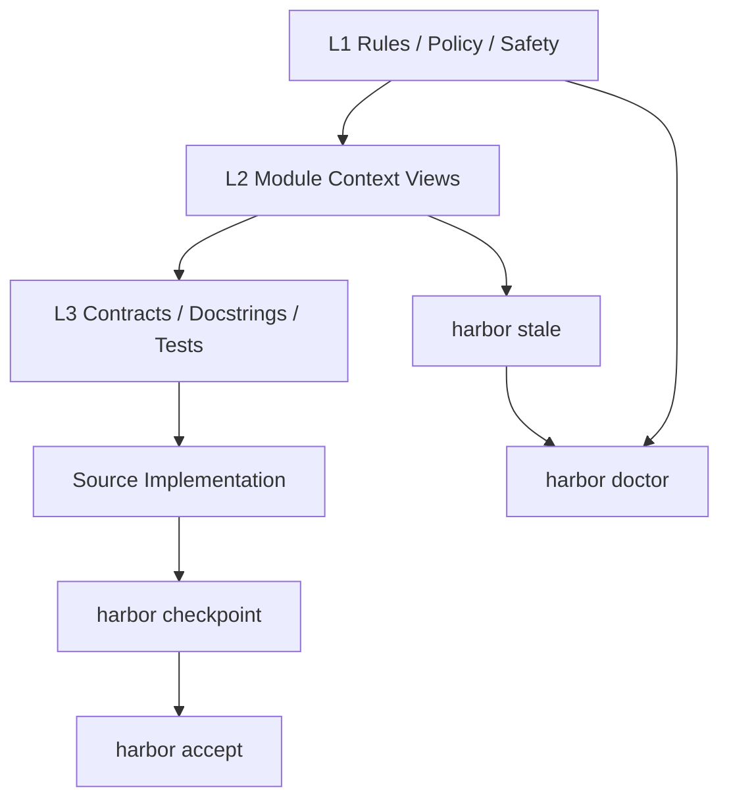

<div align="center">

# ⚓ HarborSpec

### A Context Governance Engine for Agentic Coding

[](https://github.com/ailijian/harbor-spec/actions)
[](https://www.python.org/)
[](LICENSE)
[](https://github.com/ailijian/harbor-spec)

**HarborSpec is the context governance engine for the AI coding era.**
Keep code, contracts, tests, derived context, decision records, and CI gates in sync.

[Quick Start](#-快速开始) · [Core Mental Model](#核心心智模型l1--l2--l3) · [Daily Workflow](#-日常工作流) · [CI Gates](#-ci-门禁) · [Workspace Layout](#-harbor-workspace-布局) · [Cheat Sheet](#-命令速查cheat-sheet) · [Deep Dive](#-核心机制深潜deep-dive)

</div>

Language: Chinese | [English](README.en.md)

---

<!-- Hero Section Start -->

# Why don't you trust code written by AI? Why are large enterprise projects hesitant to use AI coding?
AI coding makes writing code faster, but it also makes it easier for code and contracts to fall out of sync, causing one bug fix to potentially introduce several new ones.
HarborSpec keeps code, contracts, derived context, review baselines, and CI gates in sync, making code verifiable, traceable, and governable.

### How to use
- Start daily workflow: `harbor start`
- Finish and sync context: `harbor finish --sync-context`
- Manually review and accept the new baseline: `harbor accept`


<!-- Hero Section End -->

## What is HarborSpec?

HarborSpec is a local context governance tool for **AI coding / vibe coding / agentic coding**.

When AI can rapidly generate and modify code, what becomes harder is not "writing code", but:

* When code changes, are Docstrings / contracts still consistent?
* Do tests still verify the current behavior?
* Is the project context read by AI already stale?
* Why was this parameter, path, or return structure changed last time?
* Can CI determine if the current context and baseline are safe?

HarborSpec aims to:

> **Make context, contracts, derived documents, and semantic baselines in AI coding workflows checkable, traceable, and acceptable.**

It is not another document generator, nor another Copilot.
It is a repo-local **context governance layer**.

1. Difference from AI IDEs
 - Cursor / Claude Code / Codex solve "how to modify code faster";
 - HarborSpec solves "whether the project remains trustworthy after modification".
2. Difference from Spec Kit
 - Spec Kit focuses on "clarifying intent before starting work";
 - HarborSpec focuses on "continuously preventing semantic drift during and after development".
3. Difference from AGENTS.md
 - AGENTS.md is a behavior specification for Agents;
 - HarborSpec is an engineering context consistency governance layer.

---

## Problems HarborSpec Solves

### 1. Contract Drift

AI changes the implementation, but the contract remains unchanged:

```text
Implementation changed, contract static.
```

HarborSpec will flag potential semantic drift in `checkpoint`, and mark high-risk changes via the Contract Impact Classifier, such as:

* CLI parameter changes
* JSON output structure changes
* File write target changes
* generated view format changes
* source-of-truth rule changes

---

### 2. Stale Generated Context

AI typically prioritizes reading compressed context views, such as module READMEs, Module Capsules, and project structure views.
But these views may already be outdated.

HarborSpec maintains canonical generated views in `.harbor/views/**`, and uses integrity frontmatter with `stale` checks to determine if they remain trustworthy.

---

### 3. Lost Project Memory

Important decisions easily get scattered across chat logs, commit messages, or verbal discussions.

HarborSpec provides a Diary mechanism to record important changes, architectural decisions, and context evolution into:

```text
.harbor/diary/YYYY-MM.jsonl
```

---

### 4. Unsafe AI Automation

AI tools can easily auto-run commands, modify files, refresh docs, and accept baselines.

HarborSpec clearly distinguishes between:

* Read-only checks that AI can execute
* Derived view refreshes that AI can execute within explicit workflows
* Baseline acceptance, log writes, and release actions that must be explicitly authorized by humans

---

## Core Mental Model: L1 / L2 / L3

HarborSpec's context governance can be understood as three layers:

| Level | Name                   | Purpose                | Typical Files / Commands                                                                  |
| -- | -------------------- | ----------------- | -------------------------------------------------------------------------- |
| L1 | Constitution / Rules | Global rules, safety policies, project governance boundaries  | `AGENTS.md`, `.harbor/rules/**`, `.harbor/policy.yaml`, `.harbor/safety.yaml` |
| L2 | Module Context       | Module-level context, AI-readable derived views | `.harbor/views/l2/**`, `.harbor/views/modules/**`, `harbor stale`            |
| L3 | Contract / Docstring | Function-level contracts, test bindings, concrete implementation semantics | Docstrings, type hints, DDT, `l3_version`, `harbor checkpoint`                  |

Simplified understanding:

```text
L1 determines what rules AI should follow.
L2 determines which module contexts AI should read first.
L3 determines the specific contract for a function, interface, or behavior.
```



This is also why HarborSpec includes:

* `checkpoint`: focuses on L3 contract / implementation drift
* `stale`: focuses on whether L2 generated context is outdated
* `doctor`: focuses on overall health of L1 / workspace / derived views / skill references

---

## Source of Truth Priority

HarborSpec clearly distinguishes between **source of truth** and **derived context**.

| Priority | Level                        | Example                                                       |
| --: | ------------------------- | -------------------------------------------------------- |
|   1 | Safety / Policy           | tool sandbox, `.harbor/safety.yaml`, `.harbor/policy.yaml` |
|   2 | Explicit Contract         | docstring, schema, CLI contract, public API                 |
|   3 | Contract Tests / DDT      | explicit `l3_version` bound tests                               |
|   4 | Source Implementation     | Current source code implementation                                                   |
|   5 | Human-authored Docs       | README, design docs, rules                                 |
|   6 | Canonical Generated Views | `.harbor/views/**`                                       |
|   7 | Exports / Skills          | `<module>/README.md`, `.agents/skills/**`                 |
|   8 | Cache / State / Temp      | `.harbor/cache/**`, `.harbor/state/**`                    |

Key rules:

* `.harbor/views/**` is canonical generated context, but not source of truth.
* Generated views cannot override contracts, tests, or source implementation.
* `<module>/README.md` is an L2 README export, not canonical L2.
* `docs/harbor/**` is legacy / optional export, not canonical storage.
* `specs/diary/**` is legacy diary read-compatible, not a new write target.
* When conflicts occur, mark `semantic drift` / `contract gap`, then resolve via tests, DDT, or manual confirmation.

---

## ⚡ Quick Start

### 1. Requirements

* Python 3.9+
* Windows / macOS / Linux
* Recommended to use at the root of a Git repository
* Default command examples use PowerShell

---

### 2. Installation

```powershell
pip install harbor-spec
```

---

### 3. Initialization

Run at the project root:

```powershell
harbor init
```

`harbor init` in v1.3.0 is an interactive Setup Wizard:

* First question selects working language (Chinese / English).
* Second question only distinguishes project onboarding type (new project / existing project).
* Defaults to writing `.harbor/config/harbor.yaml` (canonical config).
* Optionally generates minimal governance entry points:
  * `AGENTS.md`
  * `.harbor/rules/role-rules.md`
  * `.harbor/rules/project-rules-guide.md`
  * `.harbor/policy.yaml`
  * `.harbor/safety.yaml`
* Does not auto-generate `.harbor/rules/project-rules.md`; it should be generated by AI coding tools based on the guide and project reality.
* Optionally generates detailed governance docs, targeting `.harbor/rules/*.md`.
* `docs/harbor/**` is a legacy / deprecated path, not a new init target in v1.3.0.
* Optionally configures LLM semantic audit; if written to `.env`, it only appends missing `HARBOR_*` keys, without overriding existing ones.
* `--force` only affects template file overwrites; it will not override existing `HARBOR_*` keys in `.env`.
* Current version only outputs AI IDE integration instructions, without auto-writing Cursor/Claude/Copilot/Windsurf proprietary files.
* `--dry-run` still prompts in interactive mode but does not write files; in non-TTY with incomplete args, it uses safe defaults and outputs a preview plan.
* Automated testing / CI is recommended to pass all args explicitly to avoid interactive blocking, e.g.:

```powershell
harbor init --dry-run --language zh --project new --governance --no-governance-docs --no-llm
```

New project prompt policy:

* Does not guide "immediately run `harbor checkpoint` / `harbor accept` after init".
* Clearly points to the complete workflow in next steps:
  * Before starting: `harbor start`
  * After completing meaningful units: `harbor finish --sync-context` + `harbor doctor`
  * After manual review: `harbor accept`

---

### 4. First Check

```powershell
harbor checkpoint
```

It checks the current Harbor baseline status and runs a fast DDT check.

---

### 5. Recommended Daily Flow

```powershell
harbor start

# Work with your AI IDE...

harbor finish --sync-context
harbor doctor
```

If you have manually reviewed and are ready to accept the new baseline:

```powershell
harbor accept
```

> HarborSpec works best with the terminal experience of AI IDEs like Cursor, Windsurf, Trae, Claude Code, Codex, etc.
> Recommend letting AI read `AGENTS.md` and `.harbor/rules/**`, but do not let AI auto-execute `harbor accept`.

---

## 🔄 Daily Workflow

Most AI coding tasks only need to remember this main line:

```powershell
harbor start
# AI coding
harbor finish --sync-context
harbor doctor
# human review
harbor accept
```

| Command                             | Purpose                                          | Recommended for AI Auto-execution |
| ------------------------------ | ------------------------------------------- | ------------ |
| `harbor start`                 | Check workspace and Harbor status before starting task                       | Allowed           |
| `harbor finish --sync-context` | Wrap-up check, refresh changed L2 README and Module Capsule | Allowed only in explicit wrap-up workflows  |
| `harbor doctor`                | Comprehensive health check                                      | Allowed           |
| `harbor accept`                | Accept new Harbor baseline after manual confirmation                   | Should not be auto-executed       |

Stricter local wrap-up:

```powershell
harbor finish --sync-context
harbor stale
harbor doctor
```

Notes:

* `finish --sync-context` remains a changed-scope sync, not a full rebuild.
* It refreshes changed modules, and derived context for related indexed parent aggregate modules.
* After sync, it performs a stale self-check on the same scope; if residual stale items exist, it outputs specific module/view and deterministic fix guidance.
* When changes hit generator / integrity critical files, it prompts you to consider explicitly running `harbor docs --all --write` and `harbor module seal --all --write`, but will not auto-execute them.
* `stale` precisely checks if L2 README and Module Capsule are outdated.
* `doctor` performs an overall health check.

---

## When to run `harbor log`?

Only recommended when this change contains important decisions:

```powershell
harbor log
```

Suitable for recording:

* Contract Change
* Breaking Change
* Architectural decisions
* Important bugfixes
* CI / runtime safety policy changes
* source-of-truth rule changes

`harbor finish --sync-context` does not auto-write Diary.
`harbor log` must be explicitly authorized by a human.

If you just want to draft a reviewable Diary Draft first, you can run:

```powershell
harbor log draft
harbor log draft --format json
harbor log draft --since-last-accept
harbor log draft --since-last-log
harbor log draft --from-report .harbor/reports/checkpoint.json
harbor log draft --output .harbor/reports/log-draft.md
```

Boundaries:

* `harbor log draft` only generates a reviewable Diary Draft, does not write a Written Diary Entry
* `harbor log draft` does not write `.harbor/diary/**`
* `harbor log draft` default boundary policy is: marker-first -> accept-fallback -> recent-fallback
* `harbor log draft --since-last-log` forces use of `last_log_marker`
* `harbor log draft --since-last-accept` forces use of latest accept
* `harbor log draft` does not advance `last_log_marker`
* In default mode, a writable Diary Draft is only generated when meaningful new evidence exists
* auto-discovered reports are supplementary evidence in default mode and will not trigger a new writable draft when existing alone
* Changes only in `.harbor/diary/**` will not alone trigger a new writable draft
* When evidence is insufficient, it does not show `Suggested Diary Entry`, does not prompt `harbor log write`, and does not refresh latest draft cache
* `harbor log draft --from-report <path>` can still explicitly use a report to generate a draft
* `harbor log draft` `--output` can write to `.harbor/reports/**`
* `harbor log draft` `--output` pointing to `.harbor/diary/**` must be rejected
* `harbor log draft` does not call LLM in v1.4.1
* LLM-assisted draft is future work, not a current capability in v1.4.1
* `harbor log draft` does not output file bodies or diff bodies
* `harbor log` / Diary write still requires manual authorization

---

## ✅ CI Gates

HarborSpec v1.4.x provides three CI gates:

```powershell
harbor checkpoint --ci
harbor stale --ci
harbor doctor --ci
```

### `checkpoint --ci`

Strict baseline gate.

Defaults to reading accepted baseline artifact in the repo:

```text
.harbor/baseline/accepted-checkpoint.json
```

Will block:

* DDT failure
* `accepted_baseline_missing`
* `accepted_baseline_invalid`
* missing / untracked function
* implementation drift
* contract_gap (`contract_required=true`)
* contract_parse_error
* contract changed
* body + contract changed
* confirmed contract impact

Category explanation (current implementation):

* `contract_gap`: Missing required contract source, blocks by default.
* `contract_parse_error`: Contract source exists but cannot be reliably parsed/classified, blocks by default.
* `skipped_no_contract`: Target does not require contract, semantic audit skipped, advisory / non-blocking.
* `possible_semantic_drift`: Only possible when a comparable contract exists.
* `contract_changed`: Contract changed (blocks when baseline not accepted).
* `contract_and_body_changed`: Contract and implementation changed simultaneously (blocks when baseline not accepted).
* `ddt_version_baseline_missing`: DDT baseline missing advisory / non-blocking.
* `possible_contract_impact`: Advisory by default, unless upgraded by state gate.
* `accepted_baseline_missing`: CI missing `.harbor/baseline/accepted-checkpoint.json`, will not fallback to runtime cache.
* `accepted_baseline_invalid`: Accepted baseline artifact schema or content is invalid, must be fixed locally before committing.

---

### `stale --ci`

Derived context freshness gate.

Will block:

* canonical L2 README stale / unknown
* canonical Module Capsule stale / unknown

Will not block:

* `<module>/README.md` export mismatch
* legacy advisory
* optional export advisory

---

### `doctor --ci`

Overall health gate.

Defaults to only blocking:

```text
DoctorCheckResult.status == FAIL
```

Will not fail directly on ordinary WARN / SKIP, e.g.:

* workspace changed advisory
* legacy metadata advisory
* legacy diary advisory
* optional export advisory

---

### CI JSON Output

All CI JSON commands guarantee:

* stdout is a single JSON object
* `writes_files=false`
* no auto-fix
* no auto-refresh
* no auto `accept`
* no mixed human text

`checkpoint --ci --format json` additionally provides:

* `baseline_source`
* `baseline_path`
* `baseline_found`

Example:

```powershell
harbor checkpoint --ci --format json
harbor stale --ci --format json
harbor doctor --ci --format json
```

Repair guidance (v1.3.1) supplement:

* `guidance` is an optional additive field, will not delete or change existing JSON field semantics.
* `guidance` is deterministically generated by default, does not use LLM, and will not change pass/fail determination of `checkpoint/stale/doctor`.
* Guidance output can be disabled via `--advice off` (retains original `reason/suggested_action/next_steps` etc. fields).
* Harbor only gives conservative prompts for `possible_semantic_drift`, does not default to judging "implementation wrong" or "contract wrong".
* `harbor next --from <report.json>` is a read-only explanation command, does not execute auto-fix, does not run `accept/log/lock`.

---

## 🧭 Harbor Workspace Layout

HarborSpec v1.3.0 uses `.harbor/*` as canonical workspace.

```text
.harbor/
  config/
    harbor.yaml              # canonical config
  views/
    project-structure.md     # canonical project structure view
    l2/
      <module>/README.md     # canonical L2 README
      _meta.json             # canonical L2 metadata
    modules/
      <module>/
        module-card.md
        review-checklist.md
        debug-playbook.md
  diary/
    YYYY-MM.jsonl            # canonical diary
  reports/
    dogfooding/
  cache/                     # ignored runtime cache
  state/                     # ignored runtime state
  exports/                   # ignored generated exports
```

### Git tracking recommendation

Recommend tracking:

```text
.harbor/config/harbor.yaml
.harbor/views/**
.harbor/diary/**
.harbor/reports/dogfooding/**
docs/design/**
```

Recommend ignoring:

```text
.harbor/cache/**
.harbor/state/**
.harbor/exports/**
.pytest_cache/**
**/__pycache__/**
```

Legacy / export paths:

| Path                     | Position                                 |
| ---------------------- | ---------------------------------- |
| `.harbor/config.yaml`  | legacy config read-compatible      |
| `.harbor/l2_meta.json` | legacy L2 metadata read-compatible |
| `specs/diary/**`       | legacy diary read-compatible       |
| `docs/harbor/**`       | optional docs export / legacy      |
| `<module>/README.md`   | human-readable L2 README export    |

---

## 🧱 Generated Context Integrity

Canonical generated markdown views in `.harbor/views/**` will include integrity frontmatter.

Example:

```yaml
---
generated_by: harbor-spec
harbor_version: 1.4.2
view_type: l2_readme
module: harbor/core
generation_command: harbor docs --module harbor/core --write
stale_policy: fail-closed
source_path_count: 12
source_paths_truncated: false
source_fingerprint: sha256:...
contract_fingerprint: sha256:...
generator_fingerprint: sha256:...
generated_at: 2026-05-09T10:00:00Z
---
```

Notes:

* `generated_at` is for informational display only.
* stale comparison ignores `generated_at`.
* When inputs are unchanged, Harbor will try to reuse the old `generated_at` to avoid meaningless Git diff.
* canonical `.harbor/views/**` is generated context.
* generated views are advisory context, not source of truth.
* generated views are not source of truth.

---

## 📌 Command Cheat Sheet

HarborSpec has many commands, but you don't need to remember them all daily.
Recommend understanding by usage scenario.

### 1. Daily AI coding

| Command                             | Description                                           |
| ------------------------------ | -------------------------------------------- |
| `harbor start`                 | Check Harbor status before starting task                            |
| `harbor checkpoint`            | Local checkpoint: status + fast DDT + contract impact summary |
| `harbor finish`                | Wrap-up check, does not refresh derived context                                |
| `harbor finish --sync-context` | Wrap-up check, refreshes changed L2 README and Module Capsule  |
| `harbor stale`                 | Check derived context freshness                            |
| `harbor doctor`                | Comprehensive health check                                       |
| `harbor accept`                | Manually accept new Harbor baseline                        |

---

### 2. CI / Release Gates

| Command                       | Description                                       |
| ------------------------ | ---------------------------------------- |
| `harbor checkpoint --ci` | Strict baseline gate                         |
| `harbor stale --ci`      | canonical generated views freshness gate |
| `harbor doctor --ci`     | workspace health gate                    |
| `--format json`          | Output machine-readable JSON                              |

---

### 3. Derived Context Generation

Usually you only need:

```powershell
harbor finish --sync-context
```

When precise control is needed:

| Command                                      | Description                                  |
| --------------------------------------- | ----------------------------------- |
| `harbor project structure --write`      | Write canonical project structure view |
| `harbor docs --changed --write`         | Refresh L2 README for changed modules      |
| `harbor docs --module <module> --write` | Refresh single module L2 README                     |
| `harbor module seal --changed --write`  | Refresh Module Capsule for changed modules |
| `harbor module seal <module> --write`   | Refresh single module Module Capsule                |

---

### 4. Workspace Diagnostics

| Command                                                 | Description                                                |
| -------------------------------------------------- | ------------------------------------------------- |
| `harbor workspace inspect`                         | Check canonical / legacy / export / cache / state layout |
| `harbor workspace inspect --format json`           | Output machine-readable workspace report                           |
| `harbor workspace migrate --dry-run`               | Read-only migration plan                                            |
| `harbor workspace migrate --dry-run --format json` | Machine-readable dry-run report                               |

Note:

```text
harbor workspace migrate --write is not implemented in v1.3.0.
```

---

### 5. Module-level Maintenance

| Command                                     | Description                      |
| -------------------------------------- | ----------------------- |
| `harbor module inspect <module>`       | View module indexed context               |
| `harbor module seal <module>`          | Preview Module Capsule       |
| `harbor module seal <module> --write`  | Write Module Capsule       |
| `harbor module stale <module>`         | Check single module Capsule freshness |
| `harbor module promote-skill <module>` | Optional: promote high-value module to skill      |

`promote-skill` is a manual action, not recommended for default execution on all modules.

---

### 6. Onboarding / Migration

| Command                               | Description                   |
| -------------------------------- | -------------------- |
| `harbor init`                    | Initialize Harbor workspace |
| `harbor adopt <path>`            | Take over existing code               |
| `harbor config list`             | View configuration                 |
| `harbor config add <pattern>`    | Add scan path               |
| `harbor config remove <pattern>` | Remove path                 |
| `harbor lock`                    | Underlying runtime cache / index rebuild operation |
| `harbor accept`                  | Write accepted baseline artifact, optionally refresh local cache |

Daily use recommends `harbor accept` as the manual acceptance command; CI only runs `checkpoint --ci`, does not run `lock`.

---

## 🤖 AI Tool Integration

HarborSpec recommends a layered rule system instead of cramming all specs into one long prompt.

Recommended structure:

```text
AGENTS.md                         # Cross-tool shared entry
.harbor/rules/role-rules.md       # TRAE / IDE light entry
.harbor/rules/project-rules.md    # Project-specific rules
.harbor/policy.yaml               # Machine-readable governance policy
.harbor/safety.yaml               # Machine-readable safety policy
.agents/skills/**                 # Optional skill integration artifacts
```

### Commands AI can auto-execute

Read-only checks:

```powershell
harbor start
harbor checkpoint
harbor stale
harbor doctor
harbor workspace inspect
harbor workspace migrate --dry-run
```

CI gates:

```powershell
harbor checkpoint --ci
harbor stale --ci
harbor doctor --ci
```

Can execute in explicit wrap-up workflows:

```powershell
harbor finish --sync-context
harbor log draft
harbor log draft --format json
harbor log draft --since-last-accept
harbor log draft --since-last-log
harbor log draft --from-report .harbor/reports/checkpoint.json
harbor log draft --output .harbor/reports/log-draft.md
```

### Commands AI should not auto-execute

Must be explicitly authorized by human:

```powershell
harbor accept
harbor log
harbor lock
harbor module promote-skill <module>
git tag
git push
```

Reasons:

* `accept` accepts new Harbor baseline
* `log` writes decision memory
* `lock` updates underlying baseline
* `promote-skill` generates external integration artifact
* `git tag/push` belongs to release actions

`harbor log draft` belongs to safe draft commands:

* Only generates reviewable Diary Draft
* Does not write `.harbor/diary/**`
* `--output` only allowed to write `.harbor/reports/**`, pointing to `.harbor/diary/**` must be rejected
* Does not call LLM in v1.4.1
* LLM-assisted draft is future work, and must also be explicitly opted-in in the future
* Does not output file bodies or diff bodies

---

## 🔍 Core Mechanism Deep Dive

### 1. Checkpoint: Semantic Baseline Check

`checkpoint` is used to answer:

> Has the current code undergone semantic changes relative to the Harbor baseline?

It checks:

* New functions
* Missing functions
* Body changed, Contract static
* Contract changed
* Body + Contract changed
* DDT binding status
* Contract Impact classification summary

Common commands:

```powershell
harbor checkpoint
harbor checkpoint --ci
```

---

### 2. Stale: Derived Context Freshness Check

`stale` is used to answer:

> Are the L2 README / Module Capsule that AI needs to read still up-to-date?

It focuses on canonical generated views in `.harbor/views/**`.

If source / contract / generator changes but derived views are not refreshed, `stale --ci` will fail.

Common fix:

```powershell
harbor finish --sync-context
```

---

### 3. Doctor: Workspace Health Check

`doctor` is used to answer:

> Is the Harbor workspace overall healthy?

It checks:

* config / index
* workspace status
* DDT fast check
* derived views
* skill references
* legacy advisory

`doctor --ci` defaults to only blocking on FAIL, WARN/SKIP are advisory.

---

### 4. L2 README: Module-level Context

L2 README is a module-level AI context view.

Canonical path:

```text
.harbor/views/l2/<module>/README.md
```

Default export:

```text
<module>/README.md
```

L2 README helps AI quickly understand:

* Module responsibilities
* Key files
* public API
* Test entry points
* Maintenance recommendations

---

### 5. Module Capsule: AI Maintenance Capsule

Module Capsule is a context package more focused on maintenance actions.

Canonical path:

```text
.harbor/views/modules/<module>/
  module-card.md
  review-checklist.md
  debug-playbook.md
```

It is suitable for helping AI judge before debug, review, refactor:

* What are this module's responsibilities?
* Which files are most important?
* What should be checked before modification?
* Where to start when debugging?

Module Capsule is a derived maintenance view, not source of truth.

---

### 6. DDT: Docstring / Contract-Driven Testing

DDT prevents "tests are still green, but testing the old contract".

Example:

```python
from harbor.core.ddt import harbor_ddt_target

@harbor_ddt_target("harbor.core.sync.SyncEngine.check_status", l3_version=1)
def test_sync_engine_drift_detection():
    ...
```

Strict targets must use explicit `l3_version`, do not use `strategy="latest"`.

DDT baseline advisory (new):

* `DDT_VERSION_BASELINE_MISSING` / `ddt_version_baseline_missing` means binding structure is valid, but L3 version baseline not found.
* This status is advisory, not a violation.
* Harbor cannot automatically decide whether to bump `l3_version`, requires manual baseline review before `harbor accept`.
* This does not mean "DDT permanently semantically passed", only means version baseline verification cannot be completed currently.

---

### 7. Diary: Decision Memory

Diary is used to record important changes and decisions.

```powershell
harbor log
```

Canonical write path:

```text
.harbor/diary/YYYY-MM.jsonl
```

`specs/diary/**` is legacy read-compatible only.

If you only need a reviewable draft instead of writing to Diary, you can use:

```powershell
harbor log draft
```

It summarizes evidence based on change-window snapshots / reports / git status, but does not write `.harbor/diary/**`.

---

## 🧪 Optional LLM Semantic Audit

HarborSpec's core checks do not strictly depend on LLM.
If you wish to enable semantic audit, you can configure `.env`:

```ini
HARBOR_LLM_PROVIDER=openai
HARBOR_LLM_API_KEY=sk-xxxxxx
HARBOR_LLM_BASE_URL=https://api.openai.com/v1
HARBOR_LANGUAGE=zh
```

Other OpenAI API compatible providers can also be used.

Semantic audit short-circuit rules (current implementation):

* Semantic audit is skipped when no usable contract source exists.
* `CONTRACT_GAP` and `SKIPPED_NO_CONTRACT` scenarios do not call LLM.
* `harbor check --format jsonl` outputs `llm_called=false` in skipped scenarios.
* `harbor check --format jsonl` is currently not "pure JSONL-only" output: it still includes human-readable DDT blocks, with semantic audit parts outputting JSONL lines.

---

## Contract Gap vs Semantic Drift

Missing contract ≠ contract drift. Harbor only enters semantic drift judgment when a comparable contract exists.

* Missing contract is not semantic drift.
* Semantic drift requires an existing comparable contract.
* `CONTRACT_GAP`: Target requires contract, but no valid contract source exists.
* `SKIPPED_NO_CONTRACT`: Target does not require contract, semantic audit is skipped.
* `CONTRACT_PARSE_ERROR`: Contract source exists, but cannot be reliably parsed or classified.

---

## 🚀 v1.3.0 Core Capabilities

v1.3.0 aims to upgrade HarborSpec from a "contract/document check tool" to an **agentic coding context governance workflow**.

Core additions:

* Canonical `.harbor/*` workspace
* `.harbor/views/**` generated context views
* Generated Context Integrity frontmatter
* Source of Truth Priority
* Contract Impact Classifier MVP
* `harbor checkpoint --ci`
* `harbor stale --ci`
* `harbor doctor --ci`
* Workspace inspect
* Workspace migrate dry-run
* L2 README canonical path
* Module Capsule canonical path
* Diary canonical path
* legacy/export advisory

---

## 🧩 Advanced: Adopt Existing Project

For existing projects, you can init first:

```powershell
harbor init
```

View config:

```powershell
harbor config list
```

Adopt existing code:

```powershell
harbor adopt backend/ --strategy safe
```

Modes:

| Mode           | Description                    |
| ------------ | --------------------- |
| `safe`       | Only adopt functions with existing docstrings   |
| `aggressive` | Insert TODO templates for public functions |
| `--dry-run`  | Preview only, no writes               |

After adoption, human confirms whether to accept baseline:

```powershell
harbor accept
```

---

## 🛡️ Runtime Safety

HarborSpec defaults to following these principles:

* Read-only checks do not write files
* `--ci` does not auto-fix
* `workspace migrate --dry-run` does not write files
* `finish --sync-context` only performs changed-scope derived context refresh and same-scope stale self-check, will not auto full-rebuild
* `accept` requires manual authorization
* `log` requires manual authorization
* `lock` should not be auto-executed by AI
* Release-related commands must be executed manually

---

## 📚 Recommended Reading

* `AGENTS.md`: Cross-tool shared entry
* `.harbor/rules/role-rules.md`: TRAE / IDE light entry
* `.harbor/rules/project-rules.md`: Project-specific rules
* `docs/design/harbor-workspace-layout-v1.md`: workspace layout design docs
* [Case: Code changed, contract didn't (IndexBuilder.iter_build drift governance)](examples/代码变了，契约没变：一次%20IndexBuilder.iter_build%20的真实漂移治理.md): A real governance case on "implementation change and contract sync"
* `.harbor/views/project-structure.md`: canonical project structure view
* `.harbor/views/l2/**`: canonical L2 README
* `.harbor/views/modules/**`: canonical Module Capsule

---

## FAQ

### Is HarborSpec a document generator?

No.
HarborSpec generates context views, but these views are only advisory context.
Its core is governing consistency between code, contracts, tests, derived context, and baselines.

---

### Do I need to remember all commands daily?

No.
Most of the time you only need:

```powershell
harbor start
harbor finish --sync-context
harbor doctor
```

Run before release:

```powershell
pytest
harbor checkpoint --ci
harbor stale --ci
harbor doctor --ci
```

---

### What's the difference between `harbor stale` and `harbor doctor`?

`stale` focuses on whether generated views are outdated.
`doctor` focuses on overall Harbor workspace health.

Simple understanding:

```text
stale = freshness check
doctor = health check
```

---

### Will `harbor finish --sync-context` auto-write Diary?

No.
It only refreshes L2 README and Module Capsule for changed modules, and performs wrap-up checks.

`harbor log` must be executed manually.

---

### Will `harbor log draft` write Diary or call LLM?

No.

```text
harbor log draft only generates reviewable Diary Draft
harbor log draft does not write .harbor/diary/**
harbor log draft --output can write .harbor/reports/**
harbor log draft --output pointing to .harbor/diary/** must be rejected
harbor log draft does not call LLM in v1.4.1
LLM-assisted draft is future work, not a current capability in v1.4.1
harbor log draft does not output file bodies or diff bodies
In default mode, writable draft is only generated when meaningful new evidence exists
reports alone in default mode are just supplementary evidence
Changes only in .harbor/diary/** will not alone trigger a new writable draft
```

If you truly need to write Diary, human must explicitly authorize and run `harbor log`.

---

### Can `harbor accept` be auto-executed by AI?

Not recommended.
`accept` represents accepting a new Harbor baseline, must be confirmed by human.

---

### Does v1.3.0 support `workspace migrate --write`?

No.
v1.3.0 only supports:

```powershell
harbor workspace migrate --dry-run
```

It only outputs migration plan, does not write files.

---

## 🚀 v1.4.2.2: Windows JSON Stdout Compatibility Closure

Harbor-spec v1.4.2.2 is a maintenance patch version focused on Windows host encoding compatibility, used to complete cp1252 runner closure and unify pure JSON stdout output strategy.

### v1.4.2.2 Current Fixes

* Pure JSON CLI output points uniformly migrated to `_emit_json_stdout()`:
  * localized JSON when stdout encoding can strictly encode payload
  * ASCII-safe fallback when it cannot
* Maintain stable pure JSON stdout under non-UTF-8 Windows host encodings:
  * cp936 hosts continue to prioritize localized JSON output
  * Hosts like cp1252 that cannot strictly encode localized text automatically fallback to ASCII-safe JSON
* `main()` contract/docstring, accepted baseline, and generated context aligned simultaneously

### v1.4.2.2 Verified

* `python -m harbor.cli.main accept`
* `python -m harbor.cli.main checkpoint --ci --format json`
* `python -m harbor.cli.main stale --ci --format json`
* `python -m harbor.cli.main doctor --ci --format json`
* GitHub Actions `CI`:
  * Ubuntu `3.9`
  * Ubuntu `3.10`
  * Ubuntu `3.11`
  * `windows-full-governance`

---

## 🚀 v1.4.2: TypeScript Contract Source Strengthening

Harbor-spec v1.4.2, building on `v1.4.1`'s Log Draft / Controlled Write workflow, restores the TypeScript mainline, and first stabilizes the governance foundation required before enabling richer contract sources.

### v1.4.2 Current Support

* TypeScript subject generalized persistence:
  * `IndexBuilder` / runtime cache / SQLite persistence paths uniformly integrated for `.ts`
  * additive identity metadata: `target_id` / `func_id` / `language` / `symbol_kind` / `qualified_name`
  * additive contract metadata: `contract_source_kinds` / `contract_source_fingerprints` / `source_confidence_summary`
* accepted baseline artifact continues as formal baseline truth for `checkpoint --ci`:
  * `.harbor/baseline/accepted-checkpoint.json`
  * runtime cache only does local acceleration and compatibility, does not carry CI truth
* richer TypeScript source strengthening:
  * exported `interface` / `type` advisory-first data contract discovery
  * `z.object(...)` / `z.enum(...)` shallow Zod source recognition
  * `export default function` / `export default class` public surface evidence
  * `contract_hash = normalized contract source bundle hash`
* additive checkpoint / `harbor next` / JSON metadata output:
  * `export_mode`
  * `data_contract_kind`
  * `schema_source_kind`
  * `contract_source_kinds`
  * `contract_source_fingerprints`
  * `source_confidence_summary`
* generated context closure wrap-up:
  * `harbor finish --sync-context`
  * `harbor stale --ci --format json`
  * `harbor doctor --ci --format json`

### v1.4.2 Explicitly Not Supported (Not Supported Yet)

* re-export graph
* `.d.ts` scanning
* `package exports` / `tsconfig` path alias
* framework preset
* TypeScript DDT
* TypeScript semantic audit
* JavaScript first-class governance
* full Zod schema semantics / schema-to-type consistency audit
* `interface/type` or Zod auto-upgrade to blocking gate

### v1.4.2 Compatibility & Acceptance Boundaries

* Python zero regression is a hard constraint:
  * Python parser / checkpoint / DDT / semantic audit / stale / doctor no regression
  * `func_id` / `target_id` compatibility no regression
* Windows full-governance is a formal acceptance dimension:
  * Ubuntu Python matrix must still pass
  * Windows path normalization regression must be covered
* `v1.4.1` Log Draft / Controlled Write workflow maintains zero regression

---

## 🚀 v1.4.0: Core Neutralization + TypeScript Contract Governance MVP

Harbor-spec v1.4.0 introduces **first-class TypeScript contract governance**.  
This is not "just adding TS file scanning", but the first step of Harbor evolving from Python `FunctionContract` / docstring-centric governance to a language-neutral `ContractSubject` model.

### v1.4.0 Current Support (MVP)

* language-neutral core model: `ContractSubject` / `ContractSource` / `LanguageAdapter`
* `AdapterRegistry`: unified language adapter entry
* TypeScript `.ts` file discovery (requires explicit enable)
* symbol recognition:
  * `export function`
  * `export async function`
  * `export const` arrow / async arrow
  * `export class` public method
* JSDoc/TSDoc proximity extraction
* `contract_presence` / `contract_required`
* `checkpoint --ci` TypeScript MVP category:
  * `contract_gap`
  * `skipped_no_contract`
  * `unsupported_syntax_advisory`
* `harbor next` deterministic guidance for TypeScript MVP category

### v1.4.0 Explicitly Not Supported (Not Supported Yet)

* JavaScript first-class governance
* `.js/.jsx/.tsx/.d.ts` default scanning
* TypeScript semantic audit
* TypeScript DDT
* Zod schema governance
* `interface/type` blocking gate
* Next.js / Express / React framework preset
* TypeScript Compiler API / tree-sitter backend

### Enable Example

```yaml
languages:
  python:
    enabled: true
  typescript:
    enabled: true
```

### Default Policy & Compatibility

* Python defaults `enabled=true`
* TypeScript defaults `enabled=false`, requires explicit enable
* After enabling TypeScript, defaults to only scanning `.ts`
* `.tsx/.js/.jsx/.d.ts` defaults to no scan
* Python behavior maintains zero regression:
  * Python checkpoint / DDT / semantic audit semantics remain compatible
  * `func_id` retains compatibility
  * `target_id/language/symbol_kind/adapter` added as additive identity fields

---

## 🚀 v1.4.1: Log Draft + Controlled Write Workflow MVP

Harbor-spec v1.4.1 clearly divides the log workflow into three layers:

```text
Evidence -> Draft Cache / Save -> Controlled Write
```

### 1. Evidence

These commands generate runtime evidence for the current change window:

```powershell
harbor checkpoint
harbor finish
harbor accept
```

Rules:

* change-window snapshots written to `.harbor/state/change-windows/**`
* snapshots belong to runtime evidence, not source-of-truth memory
* This evidence can be summarized by subsequent `harbor log draft`, but will not directly become a Written Diary Entry

### 2. Draft

```powershell
harbor log draft
harbor log draft --save
harbor log draft --since-last-accept
harbor log draft --output .harbor/reports/log-draft.md
```

Rules:

* `harbor log draft` defaults to displaying reviewable draft on stdout
* By default, a writable Diary draft is only generated when meaningful new evidence exists
* In default mode, auto-discovered reports are just supplementary evidence and will not trigger a new writable draft when existing alone
* If only `.harbor/diary/**` changes occur after the boundary, it will not alone trigger a new writable draft
* Only with explicit `--from-report <path>` can a report serve as primary evidence to generate a draft
* When generating a writable draft, `harbor log draft` will write:
  * `.harbor/state/log/latest-draft.md`
  * `.harbor/state/log/latest-draft.json`
* If evidence is insufficient, it outputs a no-op result and will not refresh latest draft cache
* `harbor log draft` default boundary policy is: marker-first -> accept-fallback -> recent-fallback
* `harbor log draft --since-last-log` forces use of `last_log_marker`
* `harbor log draft --since-last-accept` forces use of latest accept
* `harbor log draft --save` generates:
  * `.harbor/reports/log-draft-YYYYMMDD-HHMMSS.md`
  * `.harbor/reports/log-draft-YYYYMMDD-HHMMSS.json`
* `harbor log draft --output <path>` uses explicit output path and takes precedence over `--save`
* `harbor log draft` does not write `.harbor/diary/**`
* `harbor log draft` does not advance `last_log_marker`
* `harbor log draft --output` pointing to `.harbor/diary/**` must be rejected

### 3. Write

```powershell
harbor log write
harbor log write --yes
harbor log write --from-latest-draft
harbor log write --from-draft .harbor/reports/log-draft.md
```

Rules:

* `harbor log write` defaults to reading latest draft
* Without `--yes`, interactive confirmation is required
* Non-interactive environments without `--yes` must reject
* `--yes` is explicit authorization to write source-of-truth decision memory
* `--from-draft` only allows controlled sources: `.harbor/reports/**` or latest draft cache
* `.harbor/diary/**`, `.env`, `.env.*`, `secrets/**`, paths outside repo must be rejected as draft source
* After successfully writing to `.harbor/diary/YYYY-MM.jsonl`, update `.harbor/state/log/last_log_marker.json`
* `last_log_marker` represents "the last log node formally written to Diary", belongs to runtime state, not source-of-truth memory

### Security Boundaries

* `harbor log draft` does not write Diary, only `harbor log write` writes Diary
* `.harbor/state/**` and `.harbor/reports/**` are not source of truth
* `.harbor/diary/**` is the source-of-truth decision memory
* v1.4.1 does not call LLM
* LLM-assisted draft/write is future work, and must be explicitly opted-in
* Does not read or output file bodies, diff bodies, or secret values
* AI can run `harbor log draft` / `harbor log draft --save`
* AI must not auto-run `harbor log write` or `harbor log write --yes`
* Truly writing Diary still requires explicit human authorization

### Language & i18n

* Harbor working language can be configured to use Chinese or English
* CLI user-facing prompt text follows Harbor i18n / language mechanism
* JSON schema keys maintain stable English identifiers
* v1.4.1 added zh/en message keys for log write prompts and errors

---

## License

Apache-2.0
