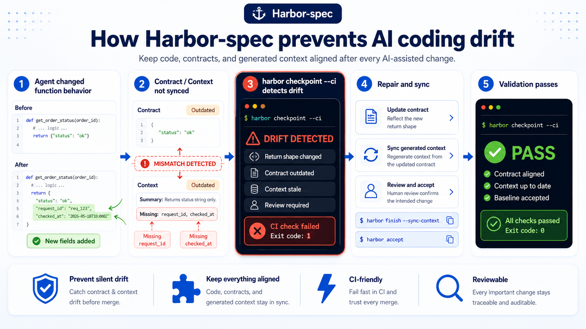
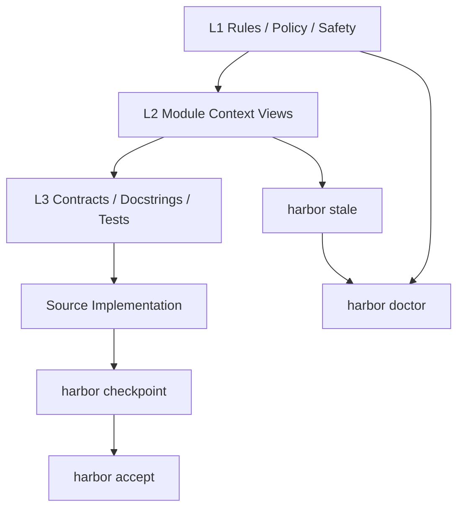

<div align="center">

# ⚓ HarborSpec

### A Context Governance Engine for Agentic Coding

[](https://github.com/ailijian/harbor-spec/actions)
[](https://www.python.org/)
[](LICENSE)
[](https://github.com/ailijian/harbor-spec)

**HarborSpec is a context governance engine for agentic coding.**
Keep code, contracts, tests, generated context, decision memory, and CI gates aligned.

[Quick Start](#quick-start) · [Core Mental Model](#core-mental-modell1-l2-l3) · [Daily Workflow](#daily-workflow) · [CI Gates](#ci-gates) · [Workspace Layout](#harbor-workspace-layout) · [Cheat Sheet](#command-cheat-sheet) · [Deep Dive](#deep-dive)

</div>

Language: [中文](README.md) | English

---

<!-- Hero Section Start -->

# AI coding writes code faster.It also makes codebases drift faster.
HarborSpec keeps code, contracts, generated context, review baselines, and CI gates aligned.

### How to use
- Start your daily workflow: `harbor start`
- Finish and sync context: `harbor finish --sync-context`
- Human review and accept new baseline: `harbor accept`



<!-- Hero Section End -->

## What is HarborSpec?

HarborSpec is a local context governance tool for **AI coding / vibe coding / agentic coding** workflows.

When AI can quickly generate and modify code, the hard part is no longer just “writing code.” The hard part becomes:

* Did the Docstring / contract stay aligned after the implementation changed?
* Do tests still validate the current behavior?
* Is the project context that AI reads still fresh?
* Why did we change this parameter, path, or return structure last time?
* Can CI tell whether the current context and baseline are safe?

HarborSpec aims to make context, contracts, generated documentation, and semantic baselines in AI coding workflows **checkable, traceable, and explicitly acceptable**.

It is not just another documentation generator.
It is not another Copilot.
It is a repo-local **context governance layer**.

---

## Problems HarborSpec Solves

### 1. Contract Drift

AI changed the implementation, but the contract did not change:

```text
Implementation changed, contract static.
```

HarborSpec surfaces potential semantic drift during `checkpoint`, and uses a Contract Impact Classifier to mark high-risk changes such as:

* CLI argument changes
* JSON output structure changes
* file write target changes
* generated view format changes
* source-of-truth rule changes

---

### 2. Stale Generated Context

AI tools often read compressed context views first, such as module README files, Module Capsules, and project structure views.
But those views can become stale.

HarborSpec maintains canonical generated views under `.harbor/views/**`, and uses integrity frontmatter plus `stale` checks to decide whether those views are still trustworthy.

---

### 3. Lost Project Memory

Important decisions often get scattered across chat logs, commit messages, and verbal discussions.

HarborSpec provides a Diary mechanism to record important changes, architectural decisions, and context evolution in:

```text
.harbor/diary/YYYY-MM.jsonl
```

---

### 4. Unsafe AI Automation

AI tools can easily run commands, modify files, refresh documents, or accept a baseline automatically.

HarborSpec explicitly separates:

* read-only checks that AI can run
* generated-context refresh commands that AI may run only in an explicit workflow
* baseline acceptance, diary logging, and release actions that require human authorization

---

## Core Mental Model：L1 / L2 / L3

HarborSpec context governance is easier to understand as three layers:

| Layer | Name                 | Role                                                             | Typical files / commands                                                      |
| ----- | -------------------- | ---------------------------------------------------------------- | ----------------------------------------------------------------------------- |
| L1    | Constitution / Rules | Global rules, safety policies, and project governance boundaries | `AGENTS.md`, `.harbor/rules/**`, `.harbor/policy.yaml`, `.harbor/safety.yaml` |
| L2    | Module Context       | Module-level context and AI-readable generated views             | `.harbor/views/l2/**`, `.harbor/views/modules/**`, `harbor stale`             |
| L3    | Contract / Docstring | Function-level contracts, test bindings, and concrete behavior   | Docstrings, type hints, DDT, `l3_version`, `harbor checkpoint`                |

Simplified:

```text
L1 tells AI what rules to follow.
L2 tells AI which module context to read first.
L3 defines the concrete contract of a function, interface, or behavior.
```



This is why HarborSpec includes:

* `checkpoint`: checks L3 contract / implementation drift
* `stale`: checks whether L2 generated context is stale
* `doctor`: checks overall L1 / workspace / derived views / skill reference health

---

## Source of Truth Priority

HarborSpec clearly separates **sources of truth** from **generated context**.

| Priority | Layer                     | Examples                                                   |
| -------: | ------------------------- | ---------------------------------------------------------- |
|        1 | Safety / Policy           | tool sandbox, `.harbor/safety.yaml`, `.harbor/policy.yaml` |
|        2 | Explicit Contract         | docstring, schema, CLI contract, public API                |
|        3 | Contract Tests / DDT      | tests bound to explicit `l3_version`                       |
|        4 | Source Implementation     | current source code behavior                               |
|        5 | Human-authored Docs       | README, design docs, rules                                 |
|        6 | Canonical Generated Views | `.harbor/views/**`                                         |
|        7 | Exports / Skills          | `<module>/README.md`, `.agents/skills/**`                  |
|        8 | Cache / State / Temp      | `.harbor/cache/**`, `.harbor/state/**`                     |

Key rules:

* `.harbor/views/**` is canonical generated context, but it is not the source of truth.
* Generated views cannot override contracts, tests, or source implementation.
* `<module>/README.md` is an L2 README export, not the canonical L2 view.
* `docs/harbor/**` is legacy / optional export, not canonical storage.
* `specs/diary/**` is legacy diary read-compatible, not the new write target.
* When conflicts happen, mark `semantic drift` / `contract gap`, then resolve through tests, DDT, or human review.

---

## ⚡ Quick Start

### 1. Requirements

* Python 3.9+
* Windows / macOS / Linux
* Recommended usage from the root of a Git repository
* Command examples below use PowerShell

---

### 2. Install

```powershell
pip install harbor-spec
```

---

### 3. Initialize

Run this at your project root:

```powershell
harbor init
```

In v1.3.0, `harbor init` is an interactive Setup Wizard:

* Step 1 selects the working language (中文 / English).
* Step 2 only asks project onboarding type (new / existing).
* It always writes canonical config to `.harbor/config/harbor.yaml`.
* It can optionally generate governance starter files:
  * `AGENTS.md`
  * `.harbor/rules/role-rules.md`
  * `.harbor/rules/project-rules-guide.md`
  * `.harbor/policy.yaml`
  * `.harbor/safety.yaml`
* It does not auto-generate `.harbor/rules/project-rules.md`; your AI coding tool should generate it from the guide and actual project context.
* Detailed governance docs are optional and written to `.harbor/rules/*.md`.
* `docs/harbor/**` is a legacy / deprecated path and is not a v1.3.0 init target.
* Optional LLM semantic audit config writes only missing `HARBOR_*` keys into `.env` (never overwrites existing keys).
* `--force` applies to template files only and does not overwrite existing `HARBOR_*` keys in `.env`.
* This version only prints AI IDE integration guidance and does not auto-write Cursor/Claude/Copilot/Windsurf specific files.
* `--dry-run` can stay interactive (prompting without writing); in non-TTY with incomplete flags, it falls back to safe defaults and prints a plan.
* For CI/automation, prefer explicit full flags to avoid interactive blocking, for example:

```powershell
harbor init --dry-run --language en --project new --governance --no-governance-docs --no-llm
```

For new projects:

* The wizard does not suggest running `harbor checkpoint` / `harbor accept` immediately after init.
* Next steps still place full workflow commands correctly:
  * before coding: `harbor start`
  * after a meaningful unit: `harbor finish --sync-context` + `harbor doctor`
  * after human review: `harbor accept`

---

### 4. First Check

```powershell
harbor checkpoint
```

This checks the current Harbor baseline state and runs a fast DDT check.

---

### 5. Recommended Daily Flow

```powershell
harbor start

# Work with your AI IDE...

harbor finish --sync-context
harbor doctor
```

If you have reviewed the changes and are ready to accept the new baseline:

```powershell
harbor accept
```

> HarborSpec works best when used from the terminal alongside AI IDEs such as Cursor, Windsurf, Trae, Claude Code, or Codex.
> Let AI read `AGENTS.md` and `.harbor/rules/**`, but do not let AI automatically run `harbor accept`.

---

## 🔄 Daily Workflow

Most AI coding tasks only need this flow:

```powershell
harbor start
# AI coding
harbor finish --sync-context
harbor doctor
# human review
harbor accept
```

| Command                        | Purpose                                                     | Should AI run it automatically?        |
| ------------------------------ | ----------------------------------------------------------- | -------------------------------------- |
| `harbor start`                 | Inspect Harbor status before starting work                  | Yes                                    |
| `harbor finish --sync-context` | Final checks and refresh changed L2 README + Module Capsule | Only in an explicit finishing workflow |
| `harbor doctor`                | Overall health check                                        | Yes                                    |
| `harbor accept`                | Human acceptance of a new Harbor baseline                   | No                                     |

For a stricter local finish:

```powershell
harbor finish --sync-context
harbor stale
harbor doctor
```

Notes:

* `finish --sync-context` remains a changed-scope sync, not a full rebuild.
* It refreshes changed modules plus any indexed parent aggregate modules in the same scope.
* After syncing, it runs a same-scope stale self-check; if residual stale remains, it prints concrete module/view repair guidance.
* When generator / integrity key files changed, it warns that you may need an explicit `harbor docs --all --write` and `harbor module seal --all --write`, but it does not run them automatically.
* `stale` checks whether L2 README and Module Capsule views are stale.
* `doctor` runs broader workspace health checks.

---

## When should I run `harbor log`?

Run `harbor log` only when the change involves an important decision:

```powershell
harbor log
```

Good cases include:

* Contract Change
* Breaking Change
* architectural decision
* important bugfix
* CI / runtime safety policy change
* source-of-truth rule change

`harbor finish --sync-context` does not automatically write Diary entries.
`harbor log` requires explicit human authorization.

If you only need a reviewable Diary Draft first, you may run:

```powershell
harbor log draft
harbor log draft --format json
harbor log draft --since-last-accept
harbor log draft --since-last-log
harbor log draft --from-report .harbor/reports/checkpoint.json
harbor log draft --output .harbor/reports/log-draft.md
```

Boundaries:

* `harbor log draft` only generates a reviewable Diary Draft and does not write a Written Diary Entry
* `harbor log draft` does not write `.harbor/diary/**`
* the default `harbor log draft` boundary strategy is marker-first -> accept-fallback -> recent-fallback
* `harbor log draft --since-last-log` forces `last_log_marker`
* `harbor log draft --since-last-accept` forces the latest accept boundary
* `harbor log draft` does not advance `last_log_marker`
* `harbor log draft --output` may write to `.harbor/reports/**`
* `harbor log draft --output` targeting `.harbor/diary/**` must be rejected
* `harbor log draft` does not call LLM in v1.4.1
* LLM-assisted draft is future work, not a v1.4.1 capability
* `harbor log draft` does not output file bodies or diff bodies
* `harbor log` / Diary write still require human authorization

---

## ✅ CI Gates

HarborSpec v1.4.x provides three CI gates:

```powershell
harbor checkpoint --ci
harbor stale --ci
harbor doctor --ci
```

### `checkpoint --ci`

Strict baseline gate.

By default it reads the repo-owned accepted baseline artifact:

```text
.harbor/baseline/accepted-checkpoint.json
```

It blocks on:

* DDT failure
* `accepted_baseline_missing`
* `accepted_baseline_invalid`
* missing / untracked function
* implementation drift
* contract_gap (`contract_required=true`)
* contract_parse_error
* contract changed
* body + contract changed
* confirmed contract impact

Current category behavior:

* `contract_gap`: required contract source is missing, can block by default.
* `contract_parse_error`: contract source exists but cannot be parsed/classified reliably, can block by default.
* `skipped_no_contract`: target does not require contract, semantic audit is skipped, advisory / non-blocking.
* `possible_semantic_drift`: only appears when a comparable contract exists.
* `contract_changed`: contract changed (blocks before baseline acceptance).
* `contract_and_body_changed`: both contract and body changed (blocks before baseline acceptance).
* `ddt_version_baseline_missing`: advisory / non-blocking.
* `possible_contract_impact`: remains advisory unless promoted by status gate.
* `accepted_baseline_missing`: `.harbor/baseline/accepted-checkpoint.json` is missing in CI; no runtime-cache fallback is used.
* `accepted_baseline_invalid`: the accepted baseline artifact schema/content is invalid and must be fixed locally, then committed.

---

### `stale --ci`

Generated-context freshness gate.

It blocks on:

* canonical L2 README stale / unknown
* canonical Module Capsule stale / unknown

It does not block on:

* `<module>/README.md` export mismatch
* legacy advisory
* optional export advisory

---

### `doctor --ci`

Overall health gate.

By default, it only blocks when:

```text
DoctorCheckResult.status == FAIL
```

It does not fail on ordinary WARN / SKIP results such as:

* workspace changed advisory
* legacy metadata advisory
* legacy diary advisory
* optional export advisory

---

### CI JSON Output

All CI JSON commands guarantee:

* stdout is a single JSON object
* `writes_files=false`
* no auto-fix
* no auto-refresh
* no automatic `accept`
* no human text mixed into JSON output

`checkpoint --ci --format json` also includes:

* `baseline_source`
* `baseline_path`
* `baseline_found`

Examples:

```powershell
harbor checkpoint --ci --format json
harbor stale --ci --format json
harbor doctor --ci --format json
```

Repair guidance (v1.3.1) notes:

* `guidance` is an optional additive field and does not remove or redefine existing JSON fields.
* `guidance` is deterministic and does not use LLM; it does not change `checkpoint/stale/doctor` pass/fail semantics.
* You can disable guidance with `--advice off` while keeping existing fields such as `reason/suggested_action/next_steps`.
* For `possible_semantic_drift`, Harbor is conservative and does not auto-decide whether implementation or contract is stale.
* `harbor next --from <report.json>` is read-only and does not run auto-fix, `accept`, `log`, or `lock`.

---

## 🧭 Harbor Workspace Layout

HarborSpec v1.3.0 uses `.harbor/*` as the canonical workspace.

```text
.harbor/
  config/
    harbor.yaml              # canonical config
  views/
    project-structure.md     # canonical project structure view
    l2/
      <module>/README.md     # canonical L2 README
      _meta.json             # canonical L2 metadata
    modules/
      <module>/
        module-card.md
        review-checklist.md
        debug-playbook.md
  diary/
    YYYY-MM.jsonl            # canonical diary
  reports/
    dogfooding/
  cache/                     # ignored runtime cache
  state/                     # ignored runtime state
  exports/                   # ignored generated exports
```

### Recommended Git tracking

Recommended to track:

```text
.harbor/config/harbor.yaml
.harbor/views/**
.harbor/diary/**
.harbor/reports/dogfooding/**
docs/design/**
```

Recommended to ignore:

```text
.harbor/cache/**
.harbor/state/**
.harbor/exports/**
.pytest_cache/**
**/__pycache__/**
```

Legacy / export paths:

| Path                   | Role                               |
| ---------------------- | ---------------------------------- |
| `.harbor/config.yaml`  | legacy config read-compatible      |
| `.harbor/l2_meta.json` | legacy L2 metadata read-compatible |
| `specs/diary/**`       | legacy diary read-compatible       |
| `docs/harbor/**`       | optional docs export / legacy      |
| `<module>/README.md`   | human-readable L2 README export    |

---

## 🧱 Generated Context Integrity

Canonical generated markdown views under `.harbor/views/**` include integrity frontmatter.

Example:

```yaml
---
generated_by: harbor-spec
harbor_version: 1.4.2
view_type: l2_readme
module: harbor/core
generation_command: harbor docs --module harbor/core --write
stale_policy: fail-closed
source_path_count: 12
source_paths_truncated: false
source_fingerprint: sha256:...
contract_fingerprint: sha256:...
generator_fingerprint: sha256:...
generated_at: 2026-05-09T10:00:00Z
---
```

Notes:

* source of truth priority applies when contracts, tests, and generated views disagree.
* `generated_at` is informational only.
* stale comparison ignores `generated_at`.
* If inputs do not change, Harbor tries to reuse the old `generated_at` to avoid meaningless Git diffs.
* canonical `.harbor/views/**` is generated context.
* generated views are advisory context, not source of truth.
* generated views are not source of truth.

---

## 📌 Command Cheat Sheet

HarborSpec has many commands, but you do not need to memorize all of them.
Use them by scenario.

### 1. Daily AI coding

| Command                        | Description                                                   |
| ------------------------------ | ------------------------------------------------------------- |
| `harbor start`                 | Inspect Harbor status before starting work                    |
| `harbor checkpoint`            | Local checkpoint: status + fast DDT + contract impact summary |
| `harbor finish`                | Final check, without refreshing generated context             |
| `harbor finish --sync-context` | Final check plus changed L2 README + Module Capsule refresh   |
| `harbor stale`                 | Check generated context freshness                             |
| `harbor doctor`                | Overall health check                                          |
| `harbor accept`                | Human acceptance of a new Harbor baseline                     |

---

### 2. CI / release gates

| Command                  | Description                              |
| ------------------------ | ---------------------------------------- |
| `harbor checkpoint --ci` | Strict baseline gate                     |
| `harbor stale --ci`      | canonical generated views freshness gate |
| `harbor doctor --ci`     | workspace health gate                    |
| `--format json`          | machine-readable JSON output             |

---

### 3. Generated context

Usually, you only need:

```powershell
harbor finish --sync-context
```

For precise control:

| Command                                 | Description                             |
| --------------------------------------- | --------------------------------------- |
| `harbor project structure --write`      | Write canonical project structure view  |
| `harbor docs --changed --write`         | Refresh changed modules' L2 README      |
| `harbor docs --module <module> --write` | Refresh one module's L2 README          |
| `harbor module seal --changed --write`  | Refresh changed modules' Module Capsule |
| `harbor module seal <module> --write`   | Refresh one module's Module Capsule     |

---

### 4. Workspace diagnostics

| Command                                            | Description                                                |
| -------------------------------------------------- | ---------------------------------------------------------- |
| `harbor workspace inspect`                         | Inspect canonical / legacy / export / cache / state layout |
| `harbor workspace inspect --format json`           | Machine-readable workspace report                          |
| `harbor workspace migrate --dry-run`               | Read-only migration plan                                   |
| `harbor workspace migrate --dry-run --format json` | Machine-readable dry-run report                            |

Note:

```text
harbor workspace migrate --write is not implemented in v1.3.0.
```

---

### 5. Module-level maintenance

| Command                                | Description                                        |
| -------------------------------------- | -------------------------------------------------- |
| `harbor module inspect <module>`       | Inspect indexed context for a module               |
| `harbor module seal <module>`          | Preview Module Capsule                             |
| `harbor module seal <module> --write`  | Write Module Capsule                               |
| `harbor module stale <module>`         | Check one module's Capsule freshness               |
| `harbor module promote-skill <module>` | Optional: promote a high-value module into a skill |

`promote-skill` is a manual action. It is not recommended for every module by default.

---

### 6. Onboarding / migration

| Command                          | Description                              |
| -------------------------------- | ---------------------------------------- |
| `harbor init`                    | Initialize Harbor workspace              |
| `harbor adopt <path>`            | Adopt existing code                      |
| `harbor config list`             | View config                              |
| `harbor config add <pattern>`    | Add scan path                            |
| `harbor config remove <pattern>` | Remove scan path                         |
| `harbor lock`                    | Low-level runtime cache / index rebuild command |
| `harbor accept`                  | Writes the accepted baseline artifact and can refresh local cache |

For daily usage, use `harbor accept` as the human acceptance command; CI should run `checkpoint --ci` and not `lock`.

---

## 🤖 AI Tool Integration

HarborSpec recommends a layered rule system instead of putting everything into one long prompt.

Recommended structure:

```text
AGENTS.md                         # shared cross-tool entrypoint
.harbor/rules/role-rules.md       # TRAE / IDE lightweight entrypoint
.harbor/rules/project-rules.md    # project-specific rules
.harbor/policy.yaml               # machine-readable governance policy
.harbor/safety.yaml               # machine-readable safety policy
.agents/skills/**                 # optional skill integration artifacts
```

### Commands AI may run automatically

Read-only checks:

```powershell
harbor start
harbor checkpoint
harbor stale
harbor doctor
harbor workspace inspect
harbor workspace migrate --dry-run
```

CI gates:

```powershell
harbor checkpoint --ci
harbor stale --ci
harbor doctor --ci
```

Allowed in an explicit finishing workflow:

```powershell
harbor finish --sync-context
harbor log draft
harbor log draft --format json
harbor log draft --since-last-accept
harbor log draft --since-last-log
harbor log draft --from-report .harbor/reports/checkpoint.json
harbor log draft --output .harbor/reports/log-draft.md
```

### Commands AI should not run automatically

These require explicit human authorization:

```powershell
harbor accept
harbor log
harbor lock
harbor module promote-skill <module>
git tag
git push
```

Why:

* `accept` accepts a new Harbor baseline
* `log` writes decision memory
* `lock` updates the low-level baseline
* `promote-skill` creates an external integration artifact
* `git tag/push` are release actions

`harbor log draft` is a safe draft command:

* it generates reviewable Diary Draft output only
* it does not write `.harbor/diary/**`
* `--output` is limited to `.harbor/reports/**`; `.harbor/diary/**` targets must be rejected
* it does not call LLM in v1.4.1
* LLM-assisted draft is future work and must remain explicit opt-in
* it does not output file bodies or diff bodies

---

## 🔍 Deep Dive

### 1. Checkpoint: semantic baseline check

`checkpoint` answers:

> Has the code changed semantically relative to the Harbor baseline?

It checks:

* new functions
* missing functions
* Body changed, Contract static
* Contract changed
* Body + Contract changed
* DDT binding status
* Contract Impact summary

Common commands:

```powershell
harbor checkpoint
harbor checkpoint --ci
```

---

### 2. Stale: generated context freshness check

`stale` answers:

> Are the L2 README / Module Capsule views that AI reads still fresh?

It focuses on canonical generated views under `.harbor/views/**`.

If source / contract / generator changes but generated views were not refreshed, `stale --ci` fails.

Common fix:

```powershell
harbor finish --sync-context
```

---

### 3. Doctor: workspace health check

`doctor` answers:

> Is the Harbor workspace healthy overall?

It checks:

* config / index
* workspace status
* DDT fast check
* derived views
* skill references
* legacy advisory

`doctor --ci` only blocks on FAIL by default. WARN/SKIP remain advisory.

---

### 4. L2 README: module-level context

L2 README is a module-level AI context view.

Canonical path:

```text
.harbor/views/l2/<module>/README.md
```

Default export:

```text
<module>/README.md
```

L2 README helps AI quickly understand:

* module responsibility
* key files
* public API
* test entrypoints
* maintenance suggestions

---

### 5. Module Capsule: AI maintenance context

Module Capsule is a context pack optimized for maintenance tasks.

Canonical path:

```text
.harbor/views/modules/<module>/
  module-card.md
  review-checklist.md
  debug-playbook.md
```

It helps AI decide before debug, review, or refactor:

* What is this module responsible for?
* Which files matter most?
* What should be checked before changing it?
* Where should debugging start?

Module Capsule is a derived maintenance view, not the source of truth.

---

### 6. DDT: Docstring / Contract-Driven Testing

DDT prevents “green tests that still validate the old contract.”

Example:

```python
from harbor.core.ddt import harbor_ddt_target

@harbor_ddt_target("harbor.core.sync.SyncEngine.check_status", l3_version=1)
def test_sync_engine_drift_detection():
    ...
```

Strict targets must use explicit `l3_version`. Do not use `strategy="latest"` for strict targets.

DDT baseline advisory (new):

* `DDT_VERSION_BASELINE_MISSING` / `ddt_version_baseline_missing` means the binding is structurally valid but no L3 contract version baseline is found.
* This is advisory, not a violation.
* Harbor cannot auto-decide whether `l3_version` should be bumped; review baseline state first, then `harbor accept`.
* This does not mean DDT is semantically verified forever.

---

### 7. Diary: decision memory

Diary records important changes and decisions.

```powershell
harbor log
```

Canonical write path:

```text
.harbor/diary/YYYY-MM.jsonl
```

`specs/diary/**` is legacy read-compatible only.

If you only need a reviewable draft instead of a real Diary write, use:

```powershell
harbor log draft
```

It may summarize evidence from change-window snapshots / reports / git status, but it does not write `.harbor/diary/**`.

---

## 🧪 Optional LLM Semantic Audit

HarborSpec core checks do not require an LLM.
If you want to enable semantic audit, configure `.env`:

```ini
HARBOR_LLM_PROVIDER=openai
HARBOR_LLM_API_KEY=sk-xxxxxx
HARBOR_LLM_BASE_URL=https://api.openai.com/v1
HARBOR_LANGUAGE=en
```

You may also use other providers compatible with the OpenAI API.

Semantic audit short-circuit behavior (current):

* Semantic audit is skipped when no valid comparable contract source exists.
* LLM is not called for `CONTRACT_GAP` / `SKIPPED_NO_CONTRACT`.
* `harbor check --format jsonl` emits `llm_called=false` for skipped cases.
* `harbor check --format jsonl` is not pure JSONL-only output: it still prints human-readable DDT blocks, while semantic audit rows are JSONL.

---

## Contract Gap vs Semantic Drift

Missing contract is not semantic drift. Harbor only performs semantic drift judgment when a comparable contract exists.

* Missing contract is not semantic drift.
* Semantic drift requires an existing comparable contract.
* `CONTRACT_GAP`: contract is required but no valid contract source exists.
* `SKIPPED_NO_CONTRACT`: contract is not required and semantic audit is skipped.
* `CONTRACT_PARSE_ERROR`: a contract source exists but cannot be parsed or classified reliably.

---

## 🚀 v1.3.0 Highlights

v1.3.0 upgrades HarborSpec from a contract / documentation checking tool into an **agentic coding context governance workflow**.

Highlights:

* Canonical `.harbor/*` workspace
* `.harbor/views/**` generated context views
* Generated Context Integrity frontmatter
* Source of Truth Priority
* Contract Impact Classifier MVP
* `harbor checkpoint --ci`
* `harbor stale --ci`
* `harbor doctor --ci`
* Workspace inspect
* Workspace migrate dry-run
* L2 README canonical path
* Module Capsule canonical path
* Diary canonical path
* legacy/export advisory

---

## 🧩 Advanced: adopting existing projects

For existing projects, initialize Harbor first:

```powershell
harbor init
```

View config:

```powershell
harbor config list
```

Adopt existing code:

```powershell
harbor adopt backend/ --strategy safe
```

Modes:

| Mode         | Description                                       |
| ------------ | ------------------------------------------------- |
| `safe`       | only adopt functions that already have docstrings |
| `aggressive` | insert TODO templates for public functions        |
| `--dry-run`  | preview only, no writes                           |

After adoption, humans should decide whether to accept the baseline:

```powershell
harbor accept
```

---

## 🛡️ Runtime Safety

HarborSpec follows these principles by default:

* read-only checks do not write files
* `--ci` does not auto-fix
* `workspace migrate --dry-run` does not write files
* `finish --sync-context` only performs changed-scope generated-context refresh plus same-scope stale self-check; it does not auto-run a full rebuild
* `accept` requires human authorization
* `log` requires human authorization
* `lock` should not be run automatically by AI
* release commands must be executed by humans

---

## 📚 Recommended Reading

* `AGENTS.md`: shared cross-tool entrypoint
* `.harbor/rules/role-rules.md`: TRAE / IDE lightweight entrypoint
* `.harbor/rules/project-rules.md`: project-specific rules
* `docs/design/harbor-workspace-layout-v1.md`: workspace layout design
* [Case Study: Code Changed, Contract Static (IndexBuilder.iter_build Drift Triage)](docs/examples/代码变了，契约没变：一次%20IndexBuilder.iter_build%20的真实漂移治理.md): a concise real-world drift governance walkthrough
* `.harbor/views/project-structure.md`: canonical project structure view
* `.harbor/views/l2/**`: canonical L2 README
* `.harbor/views/modules/**`: canonical Module Capsule

---

## FAQ

### Is HarborSpec a documentation generator?

No.
HarborSpec generates context views, but those views are advisory context.
Its core purpose is to govern consistency across code, contracts, tests, generated context, and baselines.

---

### Do I need to memorize all commands?

No.
Most of the time, you only need:

```powershell
harbor start
harbor finish --sync-context
harbor doctor
```

Before release, run:

```powershell
pytest
harbor checkpoint --ci
harbor stale --ci
harbor doctor --ci
```

---

### What is the difference between `harbor stale` and `harbor doctor`?

`stale` checks whether generated views are fresh.
`doctor` checks overall Harbor workspace health.

Simplified:

```text
stale = freshness check
doctor = health check
```

---

### Does `harbor finish --sync-context` automatically write Diary entries?

No.
It only refreshes changed modules' L2 README and Module Capsule, then runs final checks.

`harbor log` must be executed manually.

---

### Does `harbor log draft` write Diary or call an LLM?

No.

```text
harbor log draft only generates a reviewable Diary Draft
harbor log draft does not write .harbor/diary/**
harbor log draft --output may write to .harbor/reports/**
harbor log draft --output targeting .harbor/diary/** must be rejected
harbor log draft does not call LLM in v1.4.1
LLM-assisted draft is future work, not a v1.4.1 capability
harbor log draft does not output file bodies or diff bodies
```

If you want a real Diary write, a human must explicitly authorize `harbor log`.

---

### Can AI automatically run `harbor accept`?

Not recommended.
`accept` means accepting a new Harbor baseline, and it requires human confirmation.

---

### Does v1.3.0 support `workspace migrate --write`?

No.
v1.3.0 only supports:

```powershell
harbor workspace migrate --dry-run
```

It prints a migration plan and does not write files.

---


## 🚀 v1.4.2.2: Windows JSON Stdout Compatibility Closure

Harbor-spec v1.4.2.2 is a maintenance patch focused on Windows host-encoding compatibility, closing the cp1252 runner gap and unifying the pure JSON stdout emission path.

### What v1.4.2.2 fixes

* all pure JSON CLI output paths now route through `_emit_json_stdout()`:
  * localized JSON when stdout encoding can strictly encode the payload
  * ASCII-safe fallback when it cannot
* pure JSON stdout remains stable on non-UTF-8 Windows host encodings:
  * cp936 hosts continue to prefer localized JSON
  * cp1252-style hosts fall back to ASCII-safe JSON when localized content is not strictly encodable
* `main()` contract/docstring, accepted baseline, and generated context stay synchronized

### What v1.4.2.2 validates

* `python -m harbor.cli.main accept`
* `python -m harbor.cli.main checkpoint --ci --format json`
* `python -m harbor.cli.main stale --ci --format json`
* `python -m harbor.cli.main doctor --ci --format json`
* GitHub Actions `CI`:
  * Ubuntu `3.9`
  * Ubuntu `3.10`
  * Ubuntu `3.11`
  * `windows-full-governance`

---

## 🚀 v1.4.2: TypeScript Contract Source Strengthening

Harbor-spec v1.4.2 resumes the TypeScript roadmap after `v1.4.1` and tightens the governance foundation required before broader contract-source expansion.

### What v1.4.2 includes

* TypeScript subject generalized persistence through `IndexBuilder`, SQLite `entries`, and runtime cache snapshots
* additive identity metadata across persistence and checkpoint JSON:
  * `target_id`
  * `func_id` / `legacy_func_id`
  * `language`
  * `symbol_kind`
  * `qualified_name`
  * `lineno` / `end_lineno`
  * `visibility`
* richer TypeScript contract-source evidence:
  * exported `interface` / `type` advisory-first discovery
  * shallow `z.object(...)` / `z.enum(...)` recognition
  * `export default function` / `export default class` public-surface evidence
  * `contract_hash` from normalized contract source bundle hash
* additive checkpoint / `harbor next` metadata:
  * `export_mode`
  * `public_surface_evidence`
  * `data_contract_kind`
  * `schema_source_kind`
  * `contract_source_kinds`
  * `contract_source_fingerprints`
  * `source_confidence_summary`
* release-closure expectations:
  * Windows redirected CLI stdout/stderr default to UTF-8 unless explicitly overridden
  * generated context clean parity is restored
  * generated context closure follows `harbor finish --sync-context -> harbor stale --ci --format json -> harbor doctor --ci --format json`

### Not supported in v1.4.2

* re-export graph
* `.d.ts` scanning
* `package exports` / `tsconfig` path alias resolution
* framework presets
* TypeScript DDT
* TypeScript semantic audit
* JavaScript as first-class governance
* full Zod schema semantics / schema-to-type consistency audit
* automatic blocking-gate expansion for `interface/type`, Zod, or default-export evidence

### Compatibility and release boundaries

* Python behavior remains zero-regression-compatible
* `checkpoint --ci` still uses `.harbor/baseline/accepted-checkpoint.json` as the accepted baseline source of truth
* runtime cache remains local acceleration only and does not become CI truth
* Windows full-governance remains a formal release gate alongside the Ubuntu Python matrix
* the `v1.4.1` Log Draft / Controlled Write workflow remains zero-regression-compatible

---

## 🚀 v1.4.0: Core Neutralization + TypeScript Contract Governance MVP

Harbor-spec v1.4.0 introduces **first-class TypeScript contract governance**.  
This is not a narrow “TS file scanner” feature. It is the first production step from Python `FunctionContract` / docstring-centric governance to a language-neutral `ContractSubject` core.

### What v1.4.0 includes

* Language-neutral core model: `ContractSubject`, `ContractSource`, `LanguageAdapter`
* `AdapterRegistry` for language routing
* TypeScript `.ts` discovery (opt-in)
* TypeScript symbol coverage:
  * `export function`
  * `export async function`
  * exported const arrow / async arrow functions
  * exported class public methods
* JSDoc/TSDoc proximity-based contract-source extraction
* `contract_presence` and `contract_required` for TypeScript targets
* TypeScript MVP categories in `checkpoint --ci`:
  * `contract_gap`
  * `skipped_no_contract`
  * `unsupported_syntax_advisory`
* Deterministic TypeScript guidance in `harbor next`

### Not supported in v1.4.0

* JavaScript as first-class governance target
* default scanning of `.js/.jsx/.tsx/.d.ts`
* TypeScript semantic audit
* TypeScript DDT
* Zod schema governance
* interface/type blocking gate
* Next.js / Express / React framework presets
* TypeScript Compiler API / tree-sitter backend

### Configuration example

```yaml
languages:
  python:
    enabled: true
  typescript:
    enabled: true
```

### Defaults and compatibility

* Python is enabled by default
* TypeScript is disabled by default and requires explicit enablement
* When enabled, TypeScript scans `.ts` only by default
* `.tsx/.js/.jsx/.d.ts` remain excluded by default
* Python behavior remains zero-regression-compatible:
  * checkpoint / DDT / semantic audit semantics remain stable
  * `func_id` remains preserved for compatibility
  * `target_id/language/symbol_kind/adapter` are additive identity fields

---

## 🚀 v1.4.1: Log Draft + Controlled Write Workflow MVP

Harbor-spec v1.4.1 makes the log workflow explicit as three layers:

```text
Evidence -> Draft Cache / Save -> Controlled Write
```

### 1. Evidence

These commands produce runtime evidence for the current change window:

```powershell
harbor checkpoint
harbor finish
harbor accept
```

Rules:

* change-window snapshots are written under `.harbor/state/change-windows/**`
* snapshots are runtime evidence, not source-of-truth memory
* this evidence may be summarized by `harbor log draft`, but it does not become a Written Diary Entry by itself

### 2. Draft

```powershell
harbor log draft
harbor log draft --save
harbor log draft --since-last-accept
harbor log draft --output .harbor/reports/log-draft.md
```

Rules:

* `harbor log draft` prints a reviewable draft to stdout by default
* by default, it generates a writable Diary Draft only when meaningful new evidence exists
* in default mode, auto-discovered reports are supplementary evidence only and do not trigger a writable draft by themselves
* if the only post-boundary change is under `.harbor/diary/**`, that alone does not trigger a new writable draft
* only explicit `--from-report <path>` allows a report to act as primary evidence
* when a writable draft is generated, `harbor log draft` also writes:
  * `.harbor/state/log/latest-draft.md`
  * `.harbor/state/log/latest-draft.json`
* when evidence is insufficient, Harbor returns a no-op result and does not refresh latest draft cache
* the default `harbor log draft` boundary strategy is marker-first -> accept-fallback -> recent-fallback
* `harbor log draft --since-last-log` forces `last_log_marker`
* `harbor log draft --since-last-accept` forces the latest accept boundary
* `harbor log draft --save` creates:
  * `.harbor/reports/log-draft-YYYYMMDD-HHMMSS.md`
  * `.harbor/reports/log-draft-YYYYMMDD-HHMMSS.json`
* `harbor log draft --output <path>` uses the explicit output path and takes priority over `--save`
* `harbor log draft` does not write `.harbor/diary/**`
* `harbor log draft` does not advance `last_log_marker`
* `harbor log draft --output` targeting `.harbor/diary/**` must be rejected

### 3. Write

```powershell
harbor log write
harbor log write --yes
harbor log write --from-latest-draft
harbor log write --from-draft .harbor/reports/log-draft.md
```

Rules:

* `harbor log write` reads the latest draft by default
* without `--yes`, it requires interactive confirmation
* in non-interactive environments, write without `--yes` must be rejected
* `--yes` is explicit authorization to write source-of-truth decision memory
* `--from-draft` only allows controlled sources: `.harbor/reports/**` or the latest draft cache
* `.harbor/diary/**`, `.env`, `.env.*`, `secrets/**`, and repo-external paths must be rejected as draft sources
* after a successful write to `.harbor/diary/YYYY-MM.jsonl`, Harbor updates `.harbor/state/log/last_log_marker.json`
* `last_log_marker` means “the last formally written Diary node” and remains runtime state rather than source-of-truth memory

### Safety Boundaries

* `harbor log draft` never writes Diary; only `harbor log write` writes Diary
* `.harbor/state/**` and `.harbor/reports/**` are not source of truth
* `.harbor/diary/**` is the source-of-truth decision memory
* v1.4.1 does not call LLM
* LLM-assisted draft/write remains future work and must be explicit opt-in
* Harbor does not read or output file bodies, diff bodies, or secret values in this workflow
* AI may run `harbor log draft` and `harbor log draft --save`
* AI must not automatically run `harbor log write` or `harbor log write --yes`
* writing a real Diary entry still requires explicit human authorization

### Language and i18n

* Harbor may be used with Chinese or English working language, depending on configuration
* CLI user-facing messages follow Harbor's i18n / language mechanism
* JSON schema keys remain stable English identifiers
* v1.4.1 adds zh/en message keys for log write prompts and errors

---

## License

Apache-2.0
