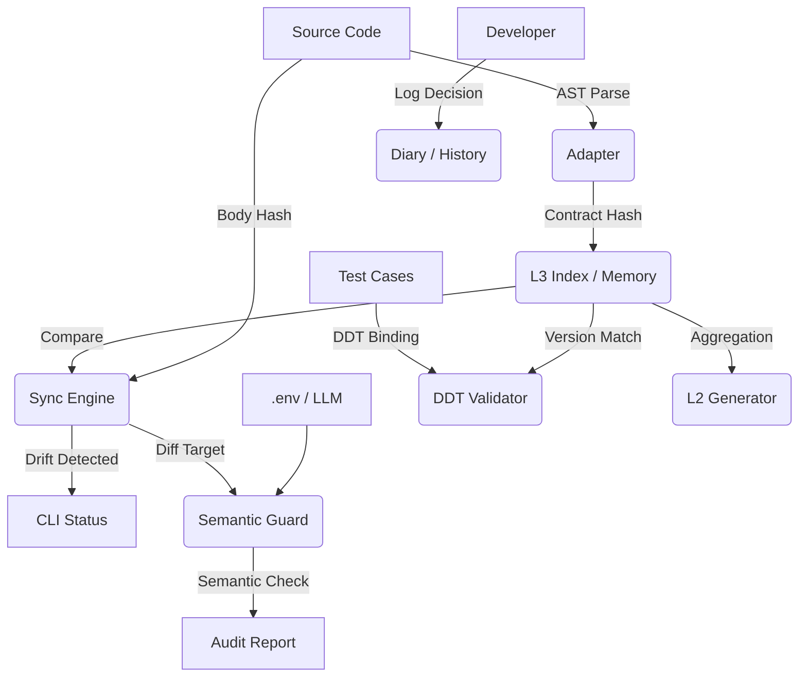

<div align="center">

# ⚓ HarborSpec
### The Context Governance Engine for Vibe Coding

[](https://github.com/your-org/harbor-spec/actions)
[](https://www.python.org/)
[](LICENSE)
[](https://github.com/your-org/harbor-spec)

**Manage AI like Code. Version Context like Git.**
**It will help you complete the revolutionary transition from “programmer to context engineer.”**

[Philosophy] • [Architecture] • [Quick Start] • [Migration Guide] • [Workflow] • [Cheatsheet]

</div>

Language: [English](README.en.md) | [中文](README.md)

---

## 🌌 The Era of Vibe Coding

Programming is undergoing a paradigm shift. We are moving from **"Writing Code"** (line-by-line) to **"Vibe Coding"** (collaborating with AI via natural language).

In this new era, **the marginal cost of code generation approaches zero, but the cost of context maintenance is skyrocketing.**

- AI modified the logic, but the Docstring is outdated? 👉 **Context Drift**
- Tests are passing, but validating old logic? 👉 **Validation Gap**
- Why did we make this parameter optional last week? 👉 **Memory Loss**

**Harbor** is born for this. It is not another Copilot; it is the **Overseer of Copilot**. It provides the **"Conscience"** and **"Memory"** governance layer for AI-generated code.

## 🛡️ Core Philosophy

Harbor is built upon **L3 Contract Theory**:

1.  **Code is Volatile, Contract is Immutable**: Implementations can be rewritten by AI at will, but the L3 Docstring (Contract) is the anchor and must be audited.
2.  **Noise is Signal**: Unindexed code, unsynced documentation, and unbound tests are "noise". Harbor makes this noise explicit.
3.  **Trust, but Verify**: We trust AI's coding ability, but we verify its output via AST analysis and Semantic Audits.

## 🏗️ Architecture



-----

## ⚡ Quick Start

### 1\. Installation

```bash
pip install harbor-spec
```

### 2\. Initialize

Run `init` in your project root. Harbor detects your project structure and generates the configuration (including Git-aware filtering):

```bash
harbor init
```

### 3\. Setup AI Role Rules (Critical\!)

To ensure Cursor/Windsurf/Copilot generates Harbor-compliant code, you must configure **Role Rules**.

<details>
<summary><strong>👉 Click to expand: Copy to .cursorrules or .windsurfrules</strong></summary>

````markdown
# Harbor-spec L3 Documentation Standards

You are a Senior Engineer working on a Harbor-spec managed project.
You MUST adhere to the **Strict L3 Contract** for all Python Docstrings.

## Scope of Application
Apply these rules to ALL **Public APIs** (Functions, Methods, and Classes that do not start with `_`).

## Format Specifications
1.  **Style**: Google Style Docstring (Extended).
2.  **Language**: English.
3.  **Indentation**: Use standard 4-space indentation.

## Required Structure
1.  **Summary**: One-line description.
2.  **Harbor Tags** (REQUIRED):
    * `@harbor.scope: public`
    * `@harbor.l3_strictness: strict`
    * `@harbor.idempotency: once` (or idempotent/side-effect)
3.  **Standard Sections**: Args / Returns / Raises.

## Reference Example
```python
def build_index(self, incremental: bool = True) -> IndexReport:
    """Build or incrementally update the L3 index cache.

    Features:
      - Scan configured code roots and parse L3 contract metadata.
      - Compute signature hash and body hash for index entries.

    @harbor.scope: public
    @harbor.l3_strictness: strict
    @harbor.idempotency: once

    Args:
        incremental (bool): Whether to enable incremental build.

    Returns:
        IndexReport: Build statistics.
    """
    ...
```
````

</details>

### 4\. Configure LLM

Create a `.env` file to enable Semantic Audit and Smart Diary features:

```ini
HARBOR_LLM_PROVIDER=openai  # or deepseek, azure
HARBOR_LLM_API_KEY=sk-xxxxxx
HARBOR_LLM_BASE_URL=https://api.openai.com/v1
HARBOR_LANGUAGE=en  # Output reports in English
```

### 5\. Build Baseline

Build the initial baseline (lock current contract snapshot) to take control of your codebase:

```bash
harbor lock
```

-----

## 🛠️ Migration Guide (Legacy Code)

Have a large existing codebase without Docstrings? Use the **Interactive Decorator** to migrate quickly.

### 1\. Scan and Decorate

```bash
harbor adopt backend/ --strategy safe
```

  * **Safe Mode (Default)**: Identifies functions that *have* docstrings but lack the `@harbor.scope` tag.
  * **Aggressive Mode**: `--strategy aggressive` identifies ALL public functions. It inserts a placeholder docstring (with `TODO`) for functions without documentation.
  * **Dry Run**: Use `--dry-run` to preview changes without writing files.

### 2\. Update Index

After adoption, lock the baseline:

```bash
harbor lock
```

-----

## 🔄 Vibe Coding Workflow

Recommended facade flow:

```powershell
harbor start
# AI coding
harbor checkpoint
# more AI coding
harbor finish
# or, when ready to sync derived context:
harbor finish --sync-context
harbor doctor
harbor log
harbor accept
```

Release track note: current packaging alignment targets `Unreleased / v1.3.0` in `RELEASE.md`.

### Workflow Facade Commands

```powershell
harbor start
harbor checkpoint
harbor finish
harbor finish --sync-context
harbor doctor
harbor accept
```

Key semantics:
- `harbor finish` does not auto-lock.
- `harbor finish` does not auto-log.
- `harbor finish` does not write README or Module Capsule by default.
- `harbor finish --sync-context` writes changed L2 READMEs and changed Module Capsules, then checks stale status for changed capsules.
- `harbor doctor` is a top-level read-only aggregate health check command (advisory, no auto-fix).
- `harbor doctor` aggregates Config/Index, Workspace Status, DDT Fast, Derived Views, and Skill References checks.
- `harbor doctor` does not write files, does not auto-lock, and does not auto-log.
- `harbor workspace inspect` is a read-only workspace layout inspection command that reports canonical paths, legacy paths, Git tracking, generated views, and advisory.
- `harbor workspace inspect` does not migrate, does not delete legacy files, and does not change write behavior (`workspace migrate` remains a future phase).
- `harbor workspace migrate --dry-run` is a read-only migration-planning command that only generates a migration plan.
- `harbor workspace migrate --dry-run` does not copy/move/delete files, does not modify config, does not modify `.gitignore`, and does not migrate diary data.
- In this version, `harbor workspace migrate` must be called with `--dry-run`; otherwise it errors and explains that only dry-run is supported.
- `harbor workspace migrate --write` is **not implemented** in the current version; release hardening only validates dry-run behavior.
- When `specs/diary/*.jsonl` exists, `harbor doctor` emits a legacy diary advisory (workspace layout / project memory guidance, not a derived-view freshness signal).
- Legacy diary advisory appears only when at least one `*.jsonl` exists; an empty `specs/diary` directory does not trigger it.
- Diary advisory is WARN-only (not FAIL), with no automatic migration or deletion of `specs/diary`.
- `harbor stale` is a top-level read-only aggregate check for both L2 README and Module Capsule freshness.
- `harbor stale` checks changed modules by default; use `--all` or `--module <module>` for other scopes.
- canonical L2 freshness in `harbor stale` is determined only by `.harbor/views/l2/<module>/README.md`.
- `harbor stale` reports `l2_readme_export` (`<module>/README.md`) as a separate advisory and does not mix it into canonical `l2_readme`.
- when canonical L2 is unavailable, `l2_readme_export` is reported as unknown/skipped and no out-of-sync comparison is performed.
- `harbor stale` does not fix stale views automatically; use `harbor docs --module <module> --write` and `harbor module seal <module> --write`.
- Use `harbor stale` when you only need derived-view freshness; use `harbor doctor` for broader Harbor health.
- MVP stale is advisory and returns success when the check completes (CI gating may be added later).
- `harbor stale --format json` and `harbor doctor --format json` provide machine-readable output (read-only and advisory).
- JSON output is intended for scripts, CI preparation, IDE panels, and future automation integrations.
- MVP JSON output does not change current exit-code behavior; `--ci` will be introduced separately.
- `harbor accept` is a semantic alias of `harbor lock`.

### L2 README Generation

```powershell
harbor docs --module harbor/core
harbor docs --module harbor/core --write
harbor docs --changed
harbor docs --changed --write
harbor docs --all
harbor docs --all --write
```

Notes:
- Default mode is preview and does not write files.
- Only `--write` writes README files.
- Canonical L2 README path is `.harbor/views/l2/<module>/README.md`.
- `<module>/README.md` remains an optional export target by default (`l2.export.module_readme.enabled=true`).
- When `l2.export.module_readme.enabled=false`, only canonical L2 README is written.
- L2 metadata canonical path is `.harbor/views/l2/_meta.json`.
- Legacy `.harbor/l2_meta.json` remains read-compatible but is no longer a write target.
- `--module`, `--changed`, and `--all` are mutually exclusive modes.

### Module Capsule

```powershell
harbor module inspect harbor/core
harbor module seal harbor/core
harbor module seal harbor/core --write
harbor module seal --changed --write
harbor module seal --all --write
harbor module stale harbor/core
harbor module stale --changed
harbor module stale --all
harbor stale
harbor stale --changed
harbor stale --all
harbor stale --module harbor/core
harbor stale --format json
harbor doctor
harbor doctor --changed
harbor doctor --all
harbor doctor --module harbor/core
harbor doctor --format json
```

Notes:
- Module Capsule is a derived maintenance view, not a source of truth.
- `module seal` defaults to preview; only `--write` writes capsule files.
- `module stale` is read-only and never writes files.
- `harbor stale` is a top-level read-only aggregate check for L2 README + Module Capsule.
- `harbor stale` defaults to `harbor stale --changed`.
- `harbor doctor` is a top-level read-only health aggregate check and defaults to `harbor doctor --changed`.
- `harbor doctor` does not fix issues and never writes docs/capsule/skill files.
- `harbor doctor` Derived Views include `l2_readme_export` advisory and legacy `.harbor/l2_meta.json` advisory (read-compatible note only; no auto-migration/deletion).
- `harbor doctor` also shows a legacy diary advisory when `specs/diary/*.jsonl` exists: `specs/diary` stays legacy read-compatible, canonical path is `.harbor/diary`, new entries write to `.harbor/diary`, and no auto-migration/deletion is performed.
- `harbor stale` (text and JSON) does not include diary advisory.
- `harbor stale --format json` and `harbor doctor --format json` emit deterministic machine-readable JSON (stdout contains JSON only).
- JSON output is advisory read-only output and does not trigger fix/write/lock/log actions.
- This MVP does not change exit-code behavior; CI gate mode (for example, `--ci`) will be added in a later step.
- Single-module / `--changed` / `--all` modes are mutually exclusive.

### Optional Skill Promotion

```powershell
harbor module promote-skill harbor/core
```

Notes:
- `promote-skill` is an optional manual action.
- Do not generate skills for all modules by default.
- If capsule is missing or stale, run this first:

```powershell
harbor module seal harbor/core --write
```

### Project Structure View

```powershell
harbor project structure
harbor project structure --write
```

Notes:
- Canonical write target is `.harbor/views/project-structure.md`.
- `docs/harbor/project-structure.md` is an optional export target (disabled by default).
- `.harbor/` is the canonical Harbor workspace and should not be ignored as a whole in `.gitignore`.
- Prefer ignoring only local runtime paths (for example: `.harbor/state/`, `.harbor/cache/`, `.harbor/exports/`, and local-only reports).
- `.harbor/views/project-structure.md` is the canonical project structure view; `docs/harbor` is an optional export destination, not canonical storage.
- `docs/design/` is for human-authored design documents and should remain trackable.
- Project Structure View is a derived project-level view, not Project Rules.
- It does not replace `AGENTS.md`, L2 README, Module Capsule, or source code.
- It helps AI coding agents understand the project quickly before debugging, reviewing, or refactoring.
- The generated view separates `Code Modules` from `Supporting Areas`.
- The output includes a `Discovery Mode` section to explain how the structure was discovered.
- In filesystem fallback mode, `Indexed Contracts` may be 0 because no Harbor index records are available.
- Default mode is preview-only and does not write files.
- `--write` always updates the canonical path; it updates `docs/harbor/project-structure.md` only when `views.export.docs.enabled=true`.
- `harbor finish --sync-context` does not auto-update Project Structure View.
- Suggested startup flow:

```powershell
harbor project structure --write
harbor start
# AI coding
harbor finish --sync-context
harbor stale
harbor doctor
harbor accept
```

-----

## 🧩 Features Deep Dive

<details>
<summary><strong>📐 DDT (Decorator-Driven Testing)</strong></summary>

Prevent "Hollow Green Lights". Bind test cases strictly to code versions.

```python
from harbor.core.ddt import harbor_ddt_target

@harbor_ddt_target("backend.core.calculate_tax", l3_version=1)
def test_calculate_tax():
    ...
```

Run `harbor check --fast`. If the contract version upgrades to v2, Harbor forces the test to fail, reminding you to update validation logic.

</details>

<details>
<summary><strong>📚 L2 Documentation Generator</strong></summary>

Automatically generate module-level READMEs as a quality dashboard.

```bash
harbor docs --module harbor/core --write
harbor docs --changed --write
harbor docs --all --write
```

Generates a Markdown file listing Public APIs, strictness status, and test coverage.
Supported modes:
- `--module`: refresh one module
- `--changed`: refresh changed modules
- `--all`: refresh all indexed modules

</details>

<details>
<summary><strong>⚙️ Configuration Management</strong></summary>

Use CLI to manage configuration safely.

```bash
harbor config list                   # View config (Rich Table)
harbor config add "scripts/**"       # Add scan path
harbor config remove "legacy/**"     # Remove scan path
```

</details>

<details>
<summary><strong>🧱 Module Capsule MVP</strong></summary>

Generate AI maintenance context capsules for a specific module (deterministic, no LLM):

```bash
harbor module inspect harbor/core
harbor module seal harbor/core
harbor module seal harbor/core --write
harbor module stale harbor/core
harbor module stale --changed
harbor module stale --all
harbor module seal --changed --write
harbor module seal --all --write
harbor module promote-skill harbor/core
```

Notes:
- Module Capsule is a derived maintenance view, not a source of truth.
- It does not replace the L2 README (canonical: `.harbor/views/l2/<module>/README.md`; optional export: `<module>/README.md`).
- `seal <module>`: refresh one module capsule.
- `seal --changed`: refresh capsules for changed modules.
- `seal --all`: refresh capsules for all indexed modules.
- `stale <module>`: check whether one module capsule matches current indexed context.
- `stale --changed`: check stale status for changed module capsules.
- `stale --all`: check stale status for all indexed module capsules.
- Default preview mode does not write files.
- `--write` is required to update capsule files.
- `module seal --write` writes canonical files under `.harbor/views/modules/<module>/` by default.
- Docs export to `docs/harbor/modules/<module>/` happens only when `views.export.docs.enabled=true`.
- In harbor-spec itself, `.harbor/views/modules/` remains trackable by default; user projects may ignore it if preferred.
- `stale` is read-only and never writes files; run `seal --write` to refresh stale capsules.
- It helps AI agents load debug/review/refactor context faster.
- `promote-skill <module>` creates a thin skill entrypoint at `.agents/skills/harbor-debug-<slug>/SKILL.md`.
- The skill references canonical capsule paths by default and does not copy capsule content.
- Skill promotion is optional; most modules only need Module Capsules.
- Promote a module only when it is complex, frequently maintained, or repeatedly debugged.
- `promote-skill` requires an existing and up-to-date module capsule.
- Recommended wrap-up flow (optional stale re-check):

```bash
harbor finish --sync-context
harbor doctor
harbor accept
```

</details>

<details>
<summary><strong>🚀 Performance Tuning (Monorepo)</strong></summary>

For large projects, **excluding irrelevant directories** is vital. The canonical config write target is `.harbor/config/harbor.yaml` (legacy `.harbor/config.yaml` remains readable), and explicit exclusion is recommended:

```yaml
exclude_paths:
  - ".venv/**"
  - "node_modules/**"  # Critical for frontend projects
  - "**/tests/**"      # Exclude test files from indexing
  - "dist/**"
```

</details>

-----

## 📝 Commands Cheatsheet

| Command | Description |
| :--- | :--- |
| `harbor init` | Auto-detect structure and initialize config. |
| `harbor start` | Workflow entrypoint: run status checks before AI coding. |
| `harbor checkpoint` | Workflow checkpoint: equivalent to `status + check --fast`. |
| `harbor finish` | Workflow wrap-up: equivalent to `status + check` with guided next steps. |
| `harbor status` / `harbor st` | Check for context status (Drift/Modified). |
| `harbor lock` / `harbor commit` | Lock current L3 snapshot into cache (baseline). |
| `harbor check` | Unified semantic audit and DDT validation. |
| `harbor check --fast` | Run DDT validation only. |
| `harbor log` | Context-aware diary: AI Draft (no args) or manual `-m` (canonical write: `.harbor/diary/YYYY-MM.jsonl`). |
| `harbor log --export` | Export diary Markdown (reads `.harbor/diary` + `specs/diary`; legacy path is read-compatible only). |
| `harbor adopt` | Interactively adopt legacy code into Harbor governance. |
| `harbor docs` | Generate module-level documentation (L2). |
| `harbor docs --changed --write` | Refresh L2 READMEs for changed modules only. |
| `harbor docs --all --write` | Refresh L2 READMEs for all indexed modules. |
| `harbor finish --sync-context` | Run `finish` checks, refresh changed L2 READMEs + Module Capsules, then run changed stale checks. |
| `harbor doctor` | Top-level read-only aggregate health check; default scope is changed modules (Config/Index, Workspace, DDT Fast, Derived Views, Skill References). |
| `harbor workspace inspect` | Top-level read-only workspace layout inspection: reports canonical/legacy paths, Git tracking, generated views, and advisory (no migration, no deletion). |
| `harbor workspace migrate --dry-run` | Top-level read-only migration planning: prints migration plan output (text/json) without performing migration or writing files. |
| `harbor stale` | Top-level read-only aggregate check; default scope is changed modules (canonical L2 README + Module Capsule), with separate module README export advisory. |
| `harbor accept` | Workflow confirmation: semantic alias of `harbor lock`. |
| `harbor module inspect <module>` | Show indexed context summary for one module (read-only, no file writes). |
| `harbor module seal <module>` | Preview module capsule output (three docs, no file writes). |
| `harbor module seal <module> --write` | Write canonical capsule files to `.harbor/views/modules/<module>/`; export to `docs/harbor/modules/<module>/` only when docs export is enabled. |
| `harbor module stale <module>` | Check whether one module capsule is stale (read-only, no file writes). |
| `harbor module stale --changed` | Batch check stale module capsules for changed modules. |
| `harbor module stale --all` | Batch check stale module capsules for all indexed modules. |
| `harbor stale --changed` | Batch check changed modules for stale derived views (L2 README + Module Capsule). |
| `harbor stale --all` | Batch check all indexed modules for stale derived views. |
| `harbor stale --module <module>` | Check one module for stale derived views (read-only, no file writes). |
| `harbor doctor --changed` | Batch aggregate health checks for changed modules (default mode). |
| `harbor doctor --all` | Batch aggregate health checks for all indexed modules. |
| `harbor doctor --module <module>` | Aggregate health checks for one module. |
| `harbor module seal --changed --write` | Batch write module capsules for changed modules. |
| `harbor module seal --all --write` | Batch write module capsules for all indexed modules. |
| `harbor module promote-skill <module>` | Manually promote one module to an optional thin skill entrypoint (`.agents/skills/.../SKILL.md`). |
| `harbor project structure` | Preview a derived project-level structure view (no file write by default). |
| `harbor project structure --write` | Write `.harbor/views/project-structure.md` by default; optionally export to `docs/harbor/project-structure.md`. |
| `harbor config` / `harbor conf` | Manage code roots and paths. |

-----

## 📄 License

MIT © 2025 Harbor-spec Authors.
