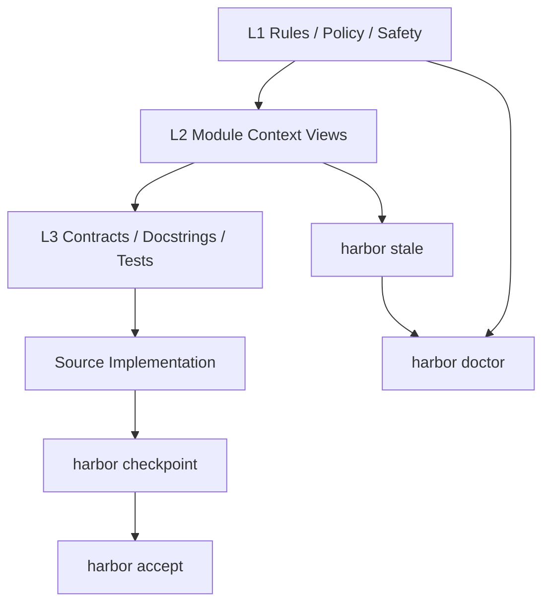

<div align="center">

# ⚓ HarborSpec

### A Context Governance Engine for Agentic Coding

[](https://github.com/your-org/harbor-spec/actions)
[](https://www.python.org/)
[](LICENSE)
[](https://github.com/your-org/harbor-spec)

**面向 AI 编程工作流的本地上下文治理引擎。**
让代码、契约、测试、派生上下文、决策记录与 CI 门禁保持一致。

[快速开始](#-快速开始) · [核心心智模型](#-核心心智模型l1--l2--l3) · [日常工作流](#-日常工作流) · [CI 门禁](#-ci-门禁) · [工作区布局](#-harbor-workspace-布局) · [命令速查](#-命令速查cheat-sheet) · [核心机制深潜](#-核心机制深潜deep-dive)

</div>

语言: 中文 | [English](README.en.md)

---

## HarborSpec 是什么？

HarborSpec 是一个面向 **AI coding / vibe coding / agentic coding** 的本地上下文治理工具。

当 AI 可以快速生成和修改代码之后，真正变难的不是“写代码”，而是：

* 代码变了，Docstring / contract 是否还一致？
* 测试是否仍然验证当前行为？
* AI 读取的项目上下文是否已经过期？
* 为什么上一次要改这个参数、路径或返回结构？
* CI 能否判断当前上下文和基线是否安全？

HarborSpec 的目标是：

> **让 AI 编程工作流中的上下文、契约、派生文档和语义基线变得可检查、可追踪、可接受。**

它不是另一个文档生成器，也不是另一个 Copilot。
它是一个 repo-local 的 **context governance layer**。

---

## HarborSpec 解决的问题

### 1. Contract Drift

AI 改了实现，但契约没变：

```text
Implementation changed, contract static.
```

HarborSpec 会在 `checkpoint` 中提示潜在语义漂移，并通过 Contract Impact Classifier 标记高风险变更，例如：

* CLI 参数变化
* JSON 输出结构变化
* 文件写入目标变化
* generated view format 变化
* source-of-truth 规则变化

---

### 2. Stale Generated Context

AI 通常会优先读取压缩后的上下文视图，例如模块 README、Module Capsule、项目结构视图。
但这些视图可能已经过期。

HarborSpec 在 `.harbor/views/**` 中维护 canonical generated views，并通过 integrity frontmatter 与 `stale` 检查判断它们是否仍然可信。

---

### 3. Lost Project Memory

重要决策容易散落在聊天记录、commit message 或口头讨论中。

HarborSpec 提供 Diary 机制，将重要变更、架构决策和上下文演进写入：

```text
.harbor/diary/YYYY-MM.jsonl
```

---

### 4. Unsafe AI Automation

AI 工具很容易自动运行命令、修改文件、刷新文档、接受基线。

HarborSpec 明确区分：

* AI 可以执行的只读检查
* AI 可在明确工作流中执行的派生视图刷新
* 必须由人类授权的基线接受、日志写入、发布动作

---

## 核心心智模型：L1 / L2 / L3

HarborSpec 的上下文治理可以理解为三层：

| 层级 | 名称                   | 作用                | 典型文件 / 命令                                                                  |
| -- | -------------------- | ----------------- | -------------------------------------------------------------------------- |
| L1 | Constitution / Rules | 全局规则、安全策略、项目治理边界  | `AGENTS.md`、`.harbor/rules/**`、`.harbor/policy.yaml`、`.harbor/safety.yaml` |
| L2 | Module Context       | 模块级上下文、AI 可读的派生视图 | `.harbor/views/l2/**`、`.harbor/views/modules/**`、`harbor stale`            |
| L3 | Contract / Docstring | 函数级契约、测试绑定、具体实现语义 | Docstring、type hints、DDT、`l3_version`、`harbor checkpoint`                  |

简化理解：

```text
L1 决定 AI 应该遵守什么规则。
L2 决定 AI 应该先读哪些模块上下文。
L3 决定某个函数、接口或行为的具体契约。
```



这也是为什么 HarborSpec 同时包含：

* `checkpoint`：关注 L3 contract / implementation drift
* `stale`：关注 L2 generated context 是否过期
* `doctor`：关注 L1 / workspace / derived views / skill references 的整体健康

---

## Source of Truth Priority

HarborSpec 明确区分 **事实源** 与 **派生上下文**。

| 优先级 | 层级                        | 示例                                                       |
| --: | ------------------------- | -------------------------------------------------------- |
|   1 | Safety / Policy           | tool sandbox、`.harbor/safety.yaml`、`.harbor/policy.yaml` |
|   2 | Explicit Contract         | docstring、schema、CLI contract、public API                 |
|   3 | Contract Tests / DDT      | explicit `l3_version` 绑定测试                               |
|   4 | Source Implementation     | 当前源码实现                                                   |
|   5 | Human-authored Docs       | README、design docs、rules                                 |
|   6 | Canonical Generated Views | `.harbor/views/**`                                       |
|   7 | Exports / Skills          | `<module>/README.md`、`.agents/skills/**`                 |
|   8 | Cache / State / Temp      | `.harbor/cache/**`、`.harbor/state/**`                    |

关键规则：

* `.harbor/views/**` 是 canonical generated context，但不是 source of truth。
* Generated views 不能覆盖 contracts、tests 或 source implementation。
* `<module>/README.md` 是 L2 README export，不是 canonical L2。
* `docs/harbor/**` 是 legacy / optional export，不是 canonical storage。
* `specs/diary/**` 是 legacy diary read-compatible，不是新写入目标。
* 发生冲突时，应标记 `semantic drift` / `contract gap`，再通过测试、DDT 或人工确认裁决。

---

## ⚡ 快速开始

### 1. 环境要求

* Python 3.9+
* Windows / macOS / Linux
* 推荐在 Git 仓库根目录使用
* 默认命令示例使用 PowerShell

---

### 2. 安装

```powershell
pip install harbor-spec
```

---

### 3. 初始化

在项目根目录执行：

```powershell
harbor init
```

`harbor init` 在 v1.3.0 中是交互式 Setup Wizard：

* 第一问选择工作语言（中文 / English）。
* 第二问仅区分项目接入类型（新项目 / 老项目）。
* 默认写入 `.harbor/config/harbor.yaml`（canonical config）。
* 可选生成最小治理入口：
  * `AGENTS.md`
  * `.harbor/rules/role-rules.md`
  * `.harbor/rules/project-rules-guide.md`
  * `.harbor/policy.yaml`
  * `.harbor/safety.yaml`
* 不自动生成 `.harbor/rules/project-rules.md`，应由 AI coding 工具基于 guide 和项目实际情况生成。
* 可选生成详细治理文档，目标路径为 `.harbor/rules/*.md`。
* `docs/harbor/**` 是 legacy / deprecated path，不作为 v1.3.0 新初始化目标。
* 可选配置 LLM semantic audit；若写入 `.env`，仅追加缺失 `HARBOR_*` key，不覆盖已有 key。
* `--force` 只影响模板类文件覆盖；不会覆盖 `.env` 里已存在的 `HARBOR_*` key。
* 当前版本仅输出 AI IDE 接入说明，不自动写 Cursor/Claude/Copilot/Windsurf 专有文件。
* `--dry-run` 在交互模式下仍会提问但不写文件；非 TTY 且参数不完整时使用安全默认并输出预览计划。
* 自动化测试 / CI 推荐显式传全参数，避免交互阻塞，例如：

```powershell
harbor init --dry-run --language zh --project new --governance --no-governance-docs --no-llm
```

新项目提示策略：

* 不引导“初始化后立刻执行 `harbor checkpoint` / `harbor accept`”。
* 在 next steps 中明确完整流程位置：
  * 开始前：`harbor start`
  * 完成有意义单元后：`harbor finish --sync-context` + `harbor doctor`
  * 人工复核后：`harbor accept`

---

### 4. 第一次检查

```powershell
harbor checkpoint
```

它会检查当前 Harbor baseline 状态，并执行快速 DDT 检查。

---

### 5. 推荐日常流

```powershell
harbor start

# Work with your AI IDE...

harbor finish --sync-context
harbor doctor
```

如果你已经人工复核并准备接受新基线：

```powershell
harbor accept
```

> HarborSpec 搭配 Cursor、Windsurf、Trae、Claude Code、Codex 等 AI IDE 的终端使用体验最佳。
> 推荐让 AI 读取 `AGENTS.md` 与 `.harbor/rules/**`，但不要让 AI 自动执行 `harbor accept`。

---

## 🔄 日常工作流

大多数 AI coding 任务只需要记住这条主线：

```powershell
harbor start
# AI coding
harbor finish --sync-context
harbor doctor
# human review
harbor accept
```

| 命令                             | 作用                                          | 是否建议 AI 自动执行 |
| ------------------------------ | ------------------------------------------- | ------------ |
| `harbor start`                 | 开始任务前查看工作区和 Harbor 状态                       | 可以           |
| `harbor finish --sync-context` | 收尾检查，并刷新 changed L2 README 与 Module Capsule | 仅在明确收尾流程中可以  |
| `harbor doctor`                | 综合健康检查                                      | 可以           |
| `harbor accept`                | 人工确认后接受新的 Harbor baseline                   | 不应自动执行       |

更严格的本地收尾：

```powershell
harbor finish --sync-context
harbor stale
harbor doctor
```

说明：

* `finish --sync-context` 会刷新 changed modules 的派生上下文。
* `stale` 精确检查 L2 README 与 Module Capsule 是否过期。
* `doctor` 做整体健康检查。

---

## 什么时候执行 `harbor log`？

只有当本次变更包含重要决策时才建议执行：

```powershell
harbor log
```

适合记录：

* Contract Change
* Breaking Change
* 架构决策
* 重要 bugfix
* CI / runtime safety 策略变化
* source-of-truth 规则变化

`harbor finish --sync-context` 不会自动写 Diary。
`harbor log` 必须由人类明确授权。

---

## ✅ CI 门禁

HarborSpec v1.3.0 提供三个 CI gate：

```powershell
harbor checkpoint --ci
harbor stale --ci
harbor doctor --ci
```

### `checkpoint --ci`

严格 baseline gate。

会阻断：

* DDT failure
* missing / untracked function
* implementation drift
* contract changed
* body + contract changed
* confirmed contract impact

不会因为 `possible_contract_impact` 直接失败。
`possible_contract_impact` 是 advisory。

---

### `stale --ci`

派生上下文 freshness gate。

会阻断：

* canonical L2 README stale / unknown
* canonical Module Capsule stale / unknown

不会阻断：

* `<module>/README.md` export mismatch
* legacy advisory
* optional export advisory

---

### `doctor --ci`

整体健康 gate。

默认只阻断：

```text
DoctorCheckResult.status == FAIL
```

不会因为普通 WARN / SKIP 直接失败，例如：

* workspace changed advisory
* legacy metadata advisory
* legacy diary advisory
* optional export advisory

---

### CI JSON 输出

所有 CI JSON 命令均保证：

* stdout 为单一 JSON 对象
* `writes_files=false`
* 不自动修复
* 不自动刷新
* 不自动 `accept`
* 不混入人类文本

示例：

```powershell
harbor checkpoint --ci --format json
harbor stale --ci --format json
harbor doctor --ci --format json
```

---

## 🧭 Harbor Workspace 布局

HarborSpec v1.3.0 使用 `.harbor/*` 作为 canonical workspace。

```text
.harbor/
  config/
    harbor.yaml              # canonical config
  views/
    project-structure.md     # canonical project structure view
    l2/
      <module>/README.md     # canonical L2 README
      _meta.json             # canonical L2 metadata
    modules/
      <module>/
        module-card.md
        review-checklist.md
        debug-playbook.md
  diary/
    YYYY-MM.jsonl            # canonical diary
  reports/
    dogfooding/
  cache/                     # ignored runtime cache
  state/                     # ignored runtime state
  exports/                   # ignored generated exports
```

### Git tracking 建议

建议追踪：

```text
.harbor/config/harbor.yaml
.harbor/views/**
.harbor/diary/**
.harbor/reports/dogfooding/**
docs/design/**
```

建议忽略：

```text
.harbor/cache/**
.harbor/state/**
.harbor/exports/**
.pytest_cache/**
**/__pycache__/**
```

Legacy / export 路径：

| 路径                     | 定位                                 |
| ---------------------- | ---------------------------------- |
| `.harbor/config.yaml`  | legacy config read-compatible      |
| `.harbor/l2_meta.json` | legacy L2 metadata read-compatible |
| `specs/diary/**`       | legacy diary read-compatible       |
| `docs/harbor/**`       | optional docs export / legacy      |
| `<module>/README.md`   | human-readable L2 README export    |

---

## 🧱 Generated Context Integrity

`.harbor/views/**` 中的 canonical generated markdown views 会包含 integrity frontmatter。

示例：

```yaml
---
generated_by: harbor-spec
harbor_version: 1.3.0
view_type: l2_readme
module: harbor/core
generation_command: harbor docs --module harbor/core --write
stale_policy: fail-closed
source_path_count: 12
source_paths_truncated: false
source_fingerprint: sha256:...
contract_fingerprint: sha256:...
generator_fingerprint: sha256:...
generated_at: 2026-05-09T10:00:00Z
---
```

说明：

* `generated_at` 仅用于信息展示。
* stale 比较会忽略 `generated_at`。
* 输入不变时，Harbor 会尽量复用旧 `generated_at`，避免无意义 Git diff。
* canonical `.harbor/views/**` is generated context.
* generated views 是 advisory context，不是 source of truth。
* generated views are not source of truth.

---

## 📌 命令速查（Cheat Sheet）

HarborSpec 命令较多，但日常不需要全部记住。
建议按使用场景理解。

### 1. 日常 AI coding

| 命令                             | 说明                                           |
| ------------------------------ | -------------------------------------------- |
| `harbor start`                 | 开始任务前查看 Harbor 状态                            |
| `harbor checkpoint`            | 本地检查点：status + fast DDT + contract impact 摘要 |
| `harbor finish`                | 收尾检查，不刷新派生上下文                                |
| `harbor finish --sync-context` | 收尾检查，并刷新 changed L2 README 与 Module Capsule  |
| `harbor stale`                 | 检查派生上下文 freshness                            |
| `harbor doctor`                | 综合健康检查                                       |
| `harbor accept`                | 人工接受新 Harbor baseline                        |

---

### 2. CI / 发布门禁

| 命令                       | 说明                                       |
| ------------------------ | ---------------------------------------- |
| `harbor checkpoint --ci` | 严格 baseline gate                         |
| `harbor stale --ci`      | canonical generated views freshness gate |
| `harbor doctor --ci`     | workspace health gate                    |
| `--format json`          | 输出机器可读 JSON                              |

---

### 3. 派生上下文生成

通常你只需要：

```powershell
harbor finish --sync-context
```

需要精确控制时可使用：

| 命令                                      | 说明                                  |
| --------------------------------------- | ----------------------------------- |
| `harbor project structure --write`      | 写入 canonical project structure view |
| `harbor docs --changed --write`         | 刷新 changed modules 的 L2 README      |
| `harbor docs --module <module> --write` | 刷新单模块 L2 README                     |
| `harbor module seal --changed --write`  | 刷新 changed modules 的 Module Capsule |
| `harbor module seal <module> --write`   | 刷新单模块 Module Capsule                |

---

### 4. Workspace 诊断

| 命令                                                 | 说明                                                |
| -------------------------------------------------- | ------------------------------------------------- |
| `harbor workspace inspect`                         | 查看 canonical / legacy / export / cache / state 布局 |
| `harbor workspace inspect --format json`           | 输出机器可读 workspace report                           |
| `harbor workspace migrate --dry-run`               | 只读迁移计划                                            |
| `harbor workspace migrate --dry-run --format json` | 机器可读 dry-run report                               |

注意：

```text
harbor workspace migrate --write is not implemented in v1.3.0.
```

---

### 5. 模块级维护

| 命令                                     | 说明                      |
| -------------------------------------- | ----------------------- |
| `harbor module inspect <module>`       | 查看模块索引上下文               |
| `harbor module seal <module>`          | 预览 Module Capsule       |
| `harbor module seal <module> --write`  | 写入 Module Capsule       |
| `harbor module stale <module>`         | 检查单模块 Capsule freshness |
| `harbor module promote-skill <module>` | 可选：将高价值模块晋升为 skill      |

`promote-skill` 是手动动作，不建议默认对所有模块执行。

---

### 6. Onboarding / Migration

| 命令                               | 说明                   |
| -------------------------------- | -------------------- |
| `harbor init`                    | 初始化 Harbor workspace |
| `harbor adopt <path>`            | 接管存量代码               |
| `harbor config list`             | 查看配置                 |
| `harbor config add <pattern>`    | 添加扫描路径               |
| `harbor config remove <pattern>` | 移除路径                 |
| `harbor lock`                    | 底层基线/索引操作            |
| `harbor accept`                  | 人类可读的接受新 baseline 动作 |

日常建议使用 `harbor accept`，而不是直接使用 `harbor lock`。

---

## 🤖 AI Tool Integration

HarborSpec 推荐使用分层规则系统，而不是把所有规范塞进一个超长 prompt。

推荐结构：

```text
AGENTS.md                         # 跨工具共享入口
.harbor/rules/role-rules.md       # TRAE / IDE 轻入口
.harbor/rules/project-rules.md    # 本项目专属规则
.harbor/policy.yaml               # 机器可读治理策略
.harbor/safety.yaml               # 机器可读安全策略
.agents/skills/**                 # 可选 skill integration artifacts
```

### AI 可以自动执行的命令

只读检查：

```powershell
harbor start
harbor checkpoint
harbor stale
harbor doctor
harbor workspace inspect
harbor workspace migrate --dry-run
```

CI gate：

```powershell
harbor checkpoint --ci
harbor stale --ci
harbor doctor --ci
```

明确收尾流程中可执行：

```powershell
harbor finish --sync-context
```

### AI 不应自动执行的命令

必须由人类明确授权：

```powershell
harbor accept
harbor log
harbor lock
harbor module promote-skill <module>
git tag
git push
```

原因：

* `accept` 接受新的 Harbor baseline
* `log` 写入决策记忆
* `lock` 更新底层基线
* `promote-skill` 生成外部 integration artifact
* `git tag/push` 属于发布动作

---

## 🔍 核心机制深潜（Deep Dive）

### 1. Checkpoint：语义基线检查

`checkpoint` 用于回答：

> 当前代码相对 Harbor baseline 是否发生了语义变化？

它会检查：

* 新增函数
* 缺失函数
* Body changed, Contract static
* Contract changed
* Body + Contract changed
* DDT 绑定状态
* Contract Impact 分类摘要

常用命令：

```powershell
harbor checkpoint
harbor checkpoint --ci
```

---

### 2. Stale：派生上下文 freshness 检查

`stale` 用于回答：

> AI 要读取的 L2 README / Module Capsule 是否还是最新？

它关注的是 `.harbor/views/**` 中的 canonical generated views。

如果 source / contract / generator 发生变化，但派生视图没有刷新，`stale --ci` 会失败。

常用修复方式：

```powershell
harbor finish --sync-context
```

---

### 3. Doctor：工作区健康检查

`doctor` 用于回答：

> Harbor workspace 整体是否健康？

它会检查：

* config / index
* workspace status
* DDT fast check
* derived views
* skill references
* legacy advisory

`doctor --ci` 默认只对 FAIL 阻断，WARN/SKIP 作为 advisory。

---

### 4. L2 README：模块级上下文

L2 README 是模块级 AI context view。

canonical 路径：

```text
.harbor/views/l2/<module>/README.md
```

默认 export：

```text
<module>/README.md
```

L2 README 帮助 AI 快速理解：

* 模块职责
* 关键文件
* public API
* 测试入口
* 维护建议

---

### 5. Module Capsule：AI 维护胶囊

Module Capsule 是更面向维护动作的上下文包。

canonical 路径：

```text
.harbor/views/modules/<module>/
  module-card.md
  review-checklist.md
  debug-playbook.md
```

它适合在 debug、review、refactor 前帮助 AI 判断：

* 这个模块的职责是什么？
* 哪些文件最重要？
* 修改前应该检查什么？
* 调试时应该从哪里入手？

Module Capsule 是 derived maintenance view，不是 source of truth。

---

### 6. DDT：Docstring / Contract-Driven Testing

DDT 用于防止“测试仍然是绿的，但测的是旧契约”。

示例：

```python
from harbor.core.ddt import harbor_ddt_target

@harbor_ddt_target("harbor.core.sync.SyncEngine.check_status", l3_version=1)
def test_sync_engine_drift_detection():
    ...
```

严格目标必须使用显式 `l3_version`，不要使用 `strategy="latest"`。

---

### 7. Diary：决策记忆

Diary 用于记录重要变更和决策。

```powershell
harbor log
```

canonical 写入路径：

```text
.harbor/diary/YYYY-MM.jsonl
```

`specs/diary/**` 仅 legacy read-compatible。

---

## 🧪 Optional LLM Semantic Audit

HarborSpec 的核心检查不强制依赖 LLM。
如果你希望启用语义审计，可以配置 `.env`：

```ini
HARBOR_LLM_PROVIDER=openai
HARBOR_LLM_API_KEY=sk-xxxxxx
HARBOR_LLM_BASE_URL=https://api.openai.com/v1
HARBOR_LANGUAGE=zh
```

也可使用其他兼容 OpenAI API 的 provider。

---

## 🚀 v1.3.0 核心能力

v1.3.0 的目标是把 HarborSpec 从“契约/文档检查工具”升级为 **agentic coding context governance workflow**。

核心新增：

* Canonical `.harbor/*` workspace
* `.harbor/views/**` generated context views
* Generated Context Integrity frontmatter
* Source of Truth Priority
* Contract Impact Classifier MVP
* `harbor checkpoint --ci`
* `harbor stale --ci`
* `harbor doctor --ci`
* Workspace inspect
* Workspace migrate dry-run
* L2 README canonical path
* Module Capsule canonical path
* Diary canonical path
* legacy/export advisory

---

## 🧩 Advanced：接管已有项目

对于已有项目，可以先初始化：

```powershell
harbor init
```

查看配置：

```powershell
harbor config list
```

接管已有代码：

```powershell
harbor adopt backend/ --strategy safe
```

模式：

| 模式           | 说明                    |
| ------------ | --------------------- |
| `safe`       | 仅接管已有 docstring 的函数   |
| `aggressive` | 为 public 函数插入 TODO 模板 |
| `--dry-run`  | 只预览，不写入               |

接管后由人类确认是否接受基线：

```powershell
harbor accept
```

---

## 🛡️ Runtime Safety

HarborSpec 默认遵守以下原则：

* 只读检查不写文件
* `--ci` 不自动修复
* `workspace migrate --dry-run` 不写文件
* `finish --sync-context` 只刷新派生上下文
* `accept` 必须人工授权
* `log` 必须人工授权
* `lock` 不应由 AI 自动执行
* 发布相关命令必须人工执行

---

## 📚 Recommended Reading

* `AGENTS.md`：跨工具共享入口
* `.harbor/rules/role-rules.md`：TRAE / IDE 轻入口
* `.harbor/rules/project-rules.md`：本项目专属规则
* `docs/design/harbor-workspace-layout-v1.md`：workspace layout 设计说明
* `.harbor/views/project-structure.md`：canonical project structure view
* `.harbor/views/l2/**`：canonical L2 README
* `.harbor/views/modules/**`：canonical Module Capsule

---

## FAQ

### HarborSpec 是文档生成器吗？

不是。
HarborSpec 会生成上下文视图，但这些视图只是 advisory context。
它的核心是治理代码、契约、测试、派生上下文和基线之间的一致性。

---

### 我每天需要记住所有命令吗？

不需要。
大多数情况下只需要：

```powershell
harbor start
harbor finish --sync-context
harbor doctor
```

发布前再运行：

```powershell
pytest
harbor checkpoint --ci
harbor stale --ci
harbor doctor --ci
```

---

### `harbor stale` 和 `harbor doctor` 有什么区别？

`stale` 关注 generated views 是否过期。
`doctor` 关注 Harbor workspace 整体健康。

简单理解：

```text
stale = freshness check
doctor = health check
```

---

### `harbor finish --sync-context` 会自动写 Diary 吗？

不会。
它只刷新 changed modules 的 L2 README 与 Module Capsule，并做收尾检查。

`harbor log` 必须手动执行。

---

### `harbor accept` 可以让 AI 自动执行吗？

不建议。
`accept` 代表接受新的 Harbor baseline，必须由人类确认。

---

### v1.3.0 支持 `workspace migrate --write` 吗？

不支持。
v1.3.0 仅支持：

```powershell
harbor workspace migrate --dry-run
```

它只输出迁移计划，不写文件。

---

## License

Apache-2.0
