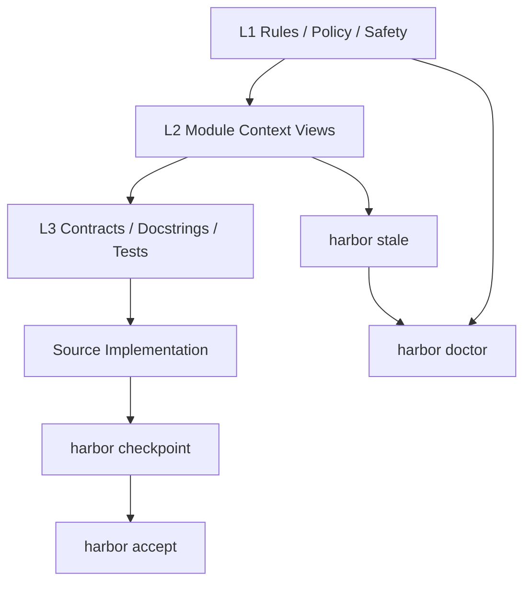

<div align="center">

# ⚓ HarborSpec

### A Context Governance Engine for Agentic Coding

[](https://github.com/your-org/harbor-spec/actions)
[](https://www.python.org/)
[](LICENSE)
[](https://github.com/your-org/harbor-spec)

**面向 AI 编程工作流的本地上下文治理引擎。**
让代码、契约、测试、派生上下文、决策记录与 CI 门禁保持一致。

[快速开始](#-快速开始) · [核心心智模型](#-核心心智模型l1--l2--l3) · [日常工作流](#-日常工作流) · [CI 门禁](#-ci-门禁) · [工作区布局](#-harbor-workspace-布局) · [命令速查](#-命令速查cheat-sheet) · [核心机制深潜](#-核心机制深潜deep-dive)

</div>

语言: 中文 | [English](README.en.md)

---

## HarborSpec 是什么？

HarborSpec 是一个面向 **AI coding / vibe coding / agentic coding** 的本地上下文治理工具。

当 AI 可以快速生成和修改代码之后，真正变难的不是“写代码”，而是：

* 代码变了，Docstring / contract 是否还一致？
* 测试是否仍然验证当前行为？
* AI 读取的项目上下文是否已经过期？
* 为什么上一次要改这个参数、路径或返回结构？
* CI 能否判断当前上下文和基线是否安全？

HarborSpec 的目标是：

> **让 AI 编程工作流中的上下文、契约、派生文档和语义基线变得可检查、可追踪、可接受。**

它不是另一个文档生成器，也不是另一个 Copilot。
它是一个 repo-local 的 **context governance layer**。

---

## 🚀 v1.4.5：Workflow UX & Preview Productization（当前正式版本）

Harbor-spec `v1.4.5` 建立在 `v1.4.4` 已完成的 TypeScript Verification Preview 基础之上，当前重点不是继续横向扩张治理能力，而是做产品成熟度收口。

### v1.4.5 版本定位

* 治理遗留项收口
* 日常工作流即时反馈增强
* 运行性能基线建立
* Preview 能力产品化交付

### v1.4.5 明确非目标

* 不新增 JavaScript first-class governance
* 不扩大到 TSX / JSX / `.d.ts`
* 不把 TS DDT Preview / Semantic Audit Preview 升级为正式 gate
* 不做 Jest / Vitest AST inference、coverage proof、自动 test-to-target binding
* 不做大规模性能架构重构

### v1.4.5 实施顺序

```text
Task Group B｜DDT Advisory 存量收口
Task Group C｜Progress Feedback Framework
Task Group D｜Performance Baseline Report
Task Group A｜Preview 使用体验产品化
```

### v1.4.5 收口快照

* DDT advisory reconciliation 已完成正式裁决：
  * `5` 条 Python strict DDT advisory 已归类为 `ACCEPTED_BACKLOG`
  * category 维持 `ddt_version_baseline_missing`
  * 当前不阻塞 `v1.4.5`，因为仓库尚无 repo-owned `l3_version` baseline source
  * 正式报告：`.harbor/reports/python-ddt-advisory-reconciliation.md`
* Progress Feedback Framework 已完成版本级收口：
  * `checkpoint` / `finish` / `check` / `verify-generated` / `docs` / `module seal` / `stale` / `doctor` 文本路径均具备统一进度反馈
  * `stale` / `doctor` 的文本分阶段进度已补齐
  * progress phase label 已改为本地化渲染文本，不再泄漏原始 `cli.progress.label.*` i18n key
  * `--format json` / `--format jsonl` / `--ci` 的机器输出继续保持纯净，不混入进度文本
* Runtime Performance Baseline 已建立：
  * 报告：`.harbor/reports/harbor-spec-runtime-performance-baseline-v145.md`
  * 机器可读 JSON：`.harbor/reports/harbor-spec-runtime-performance-baseline-v145.json`
  * `v1.4.5` 仅收口低风险 quick win：`finish` 复用首次状态报告；不扩大为结构性性能重构
* Preview productization 入口已统一：
  * guide：`docs/guides/typescript-verification-preview.md`
  * example index：`examples/typescript-verification-preview/README.md`
  * demo：`examples/typescript-verification-preview/package-public/README.md`
  * troubleshooting：`docs/guides/typescript-verification-preview-troubleshooting.md`

更多细节见：

* `docs/《Harbor-spec v1.4.5｜Workflow UX & Preview Productization 定稿版》.md`
* `RELEASE.md`

当前说明：

* `v1.4.5` 已完成 baseline acceptance、正式 Diary 写入、全量 context closure 与全量发布验证
* `ddt_version_baseline_missing=5` 已正式裁决为 `ACCEPTED_BACKLOG`，继续保持 non-blocking
* `v1.4.5` 不扩治理边界，而是聚焦产品成熟度与工作流体验收口

### Try TypeScript Verification Preview

如果你想直接上手 `v1.4.5` 收口后的 Preview 体验，而不是先翻 release note，可以从这里开始：

* Guide: `docs/guides/typescript-verification-preview.md`
* Example index: `examples/typescript-verification-preview/README.md`
* Demo scenario: `examples/typescript-verification-preview/package-public/README.md`
* Semantic audit demo: `examples/typescript-verification-preview/semantic-audit-preview/README.md`
* Failure explanations: `docs/guides/typescript-verification-preview-troubleshooting.md`

阅读顺序建议：

1. 先看 guide，确认启用方式与 Preview 边界。
2. 再跑 `package-public` 示例，看 `checkpoint` / `harbor next` 的最小工作流。
3. 最后看 troubleshooting 与 semantic audit demo，理解常见失败项和 `preview_ineligible`。

---

## 🚀 v1.4.4：TypeScript Verification Preview（上一阶段收口主题）

Harbor-spec v1.4.4 建立在 `v1.4.3` 已完成的 TypeScript contract source 与 public boundary governance 基础之上，首次把 TypeScript 纳入 **verification preview**，正式主题为：

> **TypeScript Verification Preview: DDT Binding Preview & Semantic Audit Foundation**

### v1.4.4 新增能力

* VerificationBinding foundation：
  * language-neutral verification binding 抽象
  * `target_id` 作为跨语言主锚点
  * `func_id` 继续保留给既有 Python DDT 兼容路径
* sidecar-driven TypeScript DDT preview：
  * 使用 repo-local sidecar 作为 source of truth
  * 显式声明 `target_id -> test_asset` 关系
  * MVP strategy 冻结为 `preview_strict` / `preview_reference`
* explainability 接入现有命令面：
  * `harbor check`
  * `harbor checkpoint --ci --format json`
  * `harbor next`
* semantic audit language-neutral foundation：
  * 先抽象 language-neutral audit substrate
  * 再为 TypeScript 提供 advisory preview
* TypeScript semantic audit advisory preview：
  * 仅对具备行为型契约证据的函数型 target 开放
  * `interface` / `type` / `Zod` 只作为辅助 evidence

### v1.4.4 明确非目标

* 不是正式 TypeScript DDT gate
* 不是正式 TypeScript semantic audit gate
* 不做 Jest / Vitest AST inference
* 不做 coverage 证明
* 不做自动 test-to-target 推断
* 不扩大默认 blocking gate

### v1.4.4 默认行为与验收边界

* preview 默认 `disabled`
* `enabled=false` 时不扫描 sidecar、不生成 preview findings、不引入额外副作用
* preview findings 保持 advisory-only / non-blocking
* `harbor init` / guidance 只能显式提示 preview 能力，不会静默开启
* TypeScript semantic audit preview 是 opt-in / provider-dependent preview
* 自动化测试与 release acceptance 不依赖真实 LLM 可用性
* mock / deterministic provider 是正式验收路径

---

## 🚀 v1.4.3：TypeScript Public Boundary Resolution & Project Presets

Harbor-spec v1.4.3 建立在 `v1.4.2` 已完成的 TypeScript persistence、`contract_hash` 与 accepted baseline comparison-compatible 基础之上，正式进入 **project-level public boundary governance**。

### v1.4.3 当前支持

* Public Boundary Evidence 模型：
  * `direct_export`
  * `default_export`
  * `named_re_export`
  * `star_re_export`
  * `package_export`
  * `configured_entrypoint`
  * `declaration_surface_preview` 仅作为 future preview 占位
* Public Boundary metadata / JSON additive explainability：
  * `public_boundary_state`
  * `public_boundary_confidence`
  * `public_boundary_evidence_kinds`
  * `public_boundary_evidence_items`
  * `public_boundary_reason`
  * `boundary_preset_mode`
* Minimal boundary resolution：
  * package root 识别
  * 相对路径解析
  * `.ts` 优先与 `index.ts` fallback
  * 最小 `tsconfig baseUrl/paths` 支持
  * package exports 规范化与常见 `dist/*.js -> src/*.ts` source mapping
* Project-level public boundary presets：
  * `legacy_exported`
  * `package_public`
  * `custom_entrypoints`
* `harbor init` TypeScript governance guidance：
  * 探测 `package.json`
  * 探测 `tsconfig.json`
  * 探测 `src/index.ts` / public entrypoint candidates
  * 探测 `package.json exports`
  * 探测 workspace / monorepo 标记
* `harbor next` preset-aware explanation：
  * 解释 direct export、re-export、package export、configured entrypoint、confidence 与 preset 的关系
  * 继续保持只读解释，不写文件、不自动修复、不调用 `accept/log/lock`

### v1.4.3 关键边界

* `Contract Source` 与 `Public Boundary Evidence` 明确分离：
  * re-export / package exports / configured entrypoints 不进入 `contract_source_kinds`
  * boundary evidence 不进入 `contract_hash` / `body_hash`
  * boundary metadata 变化不触发 `contract_changed` / `modified` / `drift`
* 默认兼容策略保持不变：
  * 默认仍是 `legacy_exported`
  * `contract_required_strategy` 默认仍是 `legacy_exported`
  * 非交互 `harbor init` 不会静默开启 TypeScript governance
* Windows full-governance 继续是正式验收维度

### v1.4.3 配置示例

```yaml
languages:
  python:
    enabled: true
  typescript:
    enabled: true
    public_boundary:
      mode: package_public
      follow_re_exports: true
      read_package_exports: true
      use_tsconfig_paths: true
      declaration_surface_preview: false
      entrypoints: []
      source_mappings: {}
    contract_required_strategy: legacy_exported
```

### v1.4.3 明确不支持（Not Supported Yet）

* JavaScript first-class governance
* `.js/.jsx/.tsx/.d.ts` 默认扫描
* TypeScript semantic audit
* TypeScript DDT
* full TypeScript compiler / full module graph
* full npm package resolution / bundler alias resolution
* framework-specific governance / validation
* full Zod schema semantics / schema-to-type consistency audit
* `interface/type`、Zod、boundary evidence 默认升级为 blocking gate

---

## 🚀 v1.4.2.2：Windows JSON Stdout Compatibility Closure

Harbor-spec v1.4.2.2 是围绕 Windows 主机编码兼容性的维护补丁版本，用于完成 cp1252 runner closure，并收口纯 JSON stdout 的统一输出策略。

### v1.4.2.2 本轮修复

* 纯 JSON CLI 输出点统一迁移到 `_emit_json_stdout()`：
  * localized JSON when stdout encoding can strictly encode payload
  * ASCII-safe fallback when it cannot
* Windows 非 UTF-8 主机编码下保持纯 JSON stdout 稳定：
  * cp936 主机继续优先输出 localized JSON
  * cp1252 等无法严格编码本地化文本的主机自动回退到 ASCII-safe JSON
* `main()` contract/docstring、accepted baseline 与 generated context 一并对齐

### v1.4.2.2 已验证

* `python -m harbor.cli.main accept`
* `python -m harbor.cli.main checkpoint --ci --format json`
* `python -m harbor.cli.main stale --ci --format json`
* `python -m harbor.cli.main doctor --ci --format json`
* GitHub Actions `CI`：
  * Ubuntu `3.9`
  * Ubuntu `3.10`
  * Ubuntu `3.11`
  * `windows-full-governance`

---

## 🚀 v1.4.2：TypeScript Contract Source Strengthening

Harbor-spec v1.4.2 在 `v1.4.1` 的 Log Draft / Controlled Write workflow 之上，恢复 TypeScript 主线，并先补齐 richer contract source 之前必须稳定的治理基础。

### v1.4.2 当前支持

* TypeScript subject generalized persistence：
  * `IndexBuilder` / runtime cache / SQLite 持久化路径统一接入 `.ts`
  * additive identity metadata：`target_id` / `func_id` / `language` / `symbol_kind` / `qualified_name`
  * additive contract metadata：`contract_source_kinds` / `contract_source_fingerprints` / `source_confidence_summary`
* accepted baseline artifact 继续作为 `checkpoint --ci` 的正式 baseline truth：
  * `.harbor/baseline/accepted-checkpoint.json`
  * runtime cache 仅做本地加速与兼容，不承担 CI truth
* richer TypeScript source strengthening：
  * exported `interface` / `type` advisory-first data contract discovery
  * `z.object(...)` / `z.enum(...)` shallow Zod source recognition
  * `export default function` / `export default class` public surface evidence
  * `contract_hash = normalized contract source bundle hash`
* additive checkpoint / `harbor next` / JSON metadata 输出：
  * `export_mode`
  * `data_contract_kind`
  * `schema_source_kind`
  * `contract_source_kinds`
  * `contract_source_fingerprints`
  * `source_confidence_summary`
* generated context closure 收口：
  * `harbor finish --sync-context`
  * `harbor stale --ci --format json`
  * `harbor doctor --ci --format json`

### v1.4.2 明确不支持（Not Supported Yet）

* re-export graph
* `.d.ts` scanning
* `package exports` / `tsconfig` path alias
* framework preset
* TypeScript DDT
* TypeScript semantic audit
* JavaScript first-class governance
* full Zod schema semantics / schema-to-type consistency audit
* `interface/type` 或 Zod 自动升级为 blocking gate

### v1.4.2 兼容与验收边界

* Python zero regression 是硬约束：
  * Python parser / checkpoint / DDT / semantic audit / stale / doctor 不回归
  * `func_id` / `target_id` 兼容不回归
* Windows full-governance 是正式验收维度：
  * Ubuntu Python matrix 仍必须通过
  * Windows path normalization regression 必须覆盖
* `v1.4.1` Log Draft / Controlled Write workflow 保持零回归

---

## 🚀 v1.4.0：Core Neutralization + TypeScript Contract Governance MVP

Harbor-spec v1.4.0 引入 **first-class TypeScript contract governance**。  
这不是“仅增加 TS 文件扫描”，而是 Harbor 从 Python `FunctionContract` / docstring-centric 治理，演进到 language-neutral `ContractSubject` 模型的第一步。

### v1.4.0 当前支持（MVP）

* language-neutral 核心模型：`ContractSubject` / `ContractSource` / `LanguageAdapter`
* `AdapterRegistry`：统一语言适配器入口
* TypeScript `.ts` 文件发现（需显式启用）
* symbol 识别：
  * `export function`
  * `export async function`
  * `export const` arrow / async arrow
  * `export class` public method
* JSDoc/TSDoc proximity extraction
* `contract_presence` / `contract_required`
* `checkpoint --ci` TypeScript MVP category：
  * `contract_gap`
  * `skipped_no_contract`
  * `unsupported_syntax_advisory`
* `harbor next` 对 TypeScript MVP category 的 deterministic guidance

### v1.4.0 明确不支持（Not Supported Yet）

* JavaScript first-class governance
* `.js/.jsx/.tsx/.d.ts` 默认扫描
* TypeScript semantic audit
* TypeScript DDT
* Zod schema governance
* `interface/type` blocking gate
* Next.js / Express / React framework preset
* TypeScript Compiler API / tree-sitter backend

### 启用示例

```yaml
languages:
  python:
    enabled: true
  typescript:
    enabled: true
```

### 默认策略与兼容性

* Python 默认 `enabled=true`
* TypeScript 默认 `enabled=false`，需要显式启用
* 启用 TypeScript 后默认仅扫描 `.ts`
* `.tsx/.js/.jsx/.d.ts` 默认不扫描
* Python 行为保持 zero regression：
  * Python checkpoint / DDT / semantic audit 语义保持兼容
  * `func_id` 保留兼容
  * `target_id/language/symbol_kind/adapter` 以 additive identity fields 方式新增

---

## 🚀 v1.4.1：Log Draft + Controlled Write Workflow MVP

Harbor-spec v1.4.1 将日志工作流明确分为三层：

```text
Evidence -> Draft Cache / Save -> Controlled Write
```

### 1. Evidence

这些命令会为当前 change window 产生运行时证据：

```powershell
harbor checkpoint
harbor finish
harbor accept
```

规则：

* change-window snapshots 写入 `.harbor/state/change-windows/**`
* snapshots 属于 runtime evidence，不是 source-of-truth memory
* 这些证据可以被后续 `harbor log draft` 总结，但不会直接成为 Written Diary Entry

### 2. Draft

```powershell
harbor log draft
harbor log draft --save
harbor log draft --since-last-accept
harbor log draft --output .harbor/reports/log-draft.md
```

规则：

* `harbor log draft` 默认在 stdout 展示 reviewable draft
* 默认只有在存在 meaningful new evidence 时，才会生成可写入 Diary 的 draft
* 默认模式下 auto-discovered reports 只是 supplementary evidence，单独存在时不会触发新的可写 draft
* 如果 boundary 之后只有 `.harbor/diary/**` 变化，也不会单独触发新的可写 draft
* 只有显式 `--from-report <path>` 时，report 才可作为主 evidence 生成 draft
* 生成可写 draft 时，`harbor log draft` 才会写：
  * `.harbor/state/log/latest-draft.md`
  * `.harbor/state/log/latest-draft.json`
* 如果 evidence 不足，则输出 no-op 结果，且不会刷新 latest draft cache
* `harbor log draft` 默认边界策略是：marker-first -> accept-fallback -> recent-fallback
* `harbor log draft --since-last-log` 强制使用 `last_log_marker`
* `harbor log draft --since-last-accept` 强制使用 latest accept
* `harbor log draft --save` 会生成：
  * `.harbor/reports/log-draft-YYYYMMDD-HHMMSS.md`
  * `.harbor/reports/log-draft-YYYYMMDD-HHMMSS.json`
* `harbor log draft --output <path>` 使用显式输出路径，且优先于 `--save`
* `harbor log draft` 不写 `.harbor/diary/**`
* `harbor log draft` 不推进 `last_log_marker`
* `harbor log draft --output` 指向 `.harbor/diary/**` 必须拒绝

### 3. Write

```powershell
harbor log write
harbor log write --yes
harbor log write --from-latest-draft
harbor log write --from-draft .harbor/reports/log-draft.md
```

规则：

* `harbor log write` 默认读取 latest draft
* 不带 `--yes` 时必须交互确认
* 非交互环境不带 `--yes` 必须拒绝
* `--yes` 是显式授权写入 source-of-truth decision memory
* `--from-draft` 只允许受控来源：`.harbor/reports/**` 或 latest draft cache
* `.harbor/diary/**`、`.env`、`.env.*`、`secrets/**`、repo 外路径必须拒绝为 draft source
* 成功写入 `.harbor/diary/YYYY-MM.jsonl` 后，更新 `.harbor/state/log/last_log_marker.json`
* `last_log_marker` 代表“上一次已经正式写入 Diary 的日志节点”，属于 runtime state，不是 source-of-truth memory

### 安全边界

* `harbor log draft` 不写 Diary，`harbor log write` 才会写 Diary
* `.harbor/state/**` 和 `.harbor/reports/**` 都不是 source of truth
* `.harbor/diary/**` 才是 source-of-truth decision memory
* v1.4.1 不调用 LLM
* LLM-assisted draft/write 属于 future work，且必须显式 opt-in
* 不读取或输出文件正文、diff 正文或 secret 值
* AI 可以运行 `harbor log draft` / `harbor log draft --save`
* AI 不得自动运行 `harbor log write` 或 `harbor log write --yes`
* 真正写 Diary 仍需人工明确授权

### 语言与 i18n

* Harbor 工作语言可按配置使用中文或英文
* CLI 面向用户的提示文案遵循 Harbor i18n / language 机制
* JSON schema keys 保持稳定英文标识符
* v1.4.1 为 log write 的提示与错误补充了 zh/en message keys

---

## HarborSpec 解决的问题

### 1. Contract Drift

AI 改了实现，但契约没变：

```text
Implementation changed, contract static.
```

HarborSpec 会在 `checkpoint` 中提示潜在语义漂移，并通过 Contract Impact Classifier 标记高风险变更，例如：

* CLI 参数变化
* JSON 输出结构变化
* 文件写入目标变化
* generated view format 变化
* source-of-truth 规则变化

---

### 2. Stale Generated Context

AI 通常会优先读取压缩后的上下文视图，例如模块 README、Module Capsule、项目结构视图。
但这些视图可能已经过期。

HarborSpec 在 `.harbor/views/**` 中维护 canonical generated views，并通过 integrity frontmatter 与 `stale` 检查判断它们是否仍然可信。

---

### 3. Lost Project Memory

重要决策容易散落在聊天记录、commit message 或口头讨论中。

HarborSpec 提供 Diary 机制，将重要变更、架构决策和上下文演进写入：

```text
.harbor/diary/YYYY-MM.jsonl
```

---

### 4. Unsafe AI Automation

AI 工具很容易自动运行命令、修改文件、刷新文档、接受基线。

HarborSpec 明确区分：

* AI 可以执行的只读检查
* AI 可在明确工作流中执行的派生视图刷新
* 必须由人类授权的基线接受、日志写入、发布动作

---

## 核心心智模型：L1 / L2 / L3

HarborSpec 的上下文治理可以理解为三层：

| 层级 | 名称                   | 作用                | 典型文件 / 命令                                                                  |
| -- | -------------------- | ----------------- | -------------------------------------------------------------------------- |
| L1 | Constitution / Rules | 全局规则、安全策略、项目治理边界  | `AGENTS.md`、`.harbor/rules/**`、`.harbor/policy.yaml`、`.harbor/safety.yaml` |
| L2 | Module Context       | 模块级上下文、AI 可读的派生视图 | `.harbor/views/l2/**`、`.harbor/views/modules/**`、`harbor stale`            |
| L3 | Contract / Docstring | 函数级契约、测试绑定、具体实现语义 | Docstring、type hints、DDT、`l3_version`、`harbor checkpoint`                  |

简化理解：

```text
L1 决定 AI 应该遵守什么规则。
L2 决定 AI 应该先读哪些模块上下文。
L3 决定某个函数、接口或行为的具体契约。
```



这也是为什么 HarborSpec 同时包含：

* `checkpoint`：关注 L3 contract / implementation drift
* `stale`：关注 L2 generated context 是否过期
* `doctor`：关注 L1 / workspace / derived views / skill references 的整体健康

---

## Source of Truth Priority

HarborSpec 明确区分 **事实源** 与 **派生上下文**。

| 优先级 | 层级                        | 示例                                                       |
| --: | ------------------------- | -------------------------------------------------------- |
|   1 | Safety / Policy           | tool sandbox、`.harbor/safety.yaml`、`.harbor/policy.yaml` |
|   2 | Explicit Contract         | docstring、schema、CLI contract、public API                 |
|   3 | Contract Tests / DDT      | explicit `l3_version` 绑定测试                               |
|   4 | Source Implementation     | 当前源码实现                                                   |
|   5 | Human-authored Docs       | README、design docs、rules                                 |
|   6 | Canonical Generated Views | `.harbor/views/**`                                       |
|   7 | Exports / Skills          | `<module>/README.md`、`.agents/skills/**`                 |
|   8 | Cache / State / Temp      | `.harbor/cache/**`、`.harbor/state/**`                    |

关键规则：

* `.harbor/views/**` 是 canonical generated context，但不是 source of truth。
* Generated views 不能覆盖 contracts、tests 或 source implementation。
* `<module>/README.md` 是 L2 README export，不是 canonical L2。
* `docs/harbor/**` 是 legacy / optional export，不是 canonical storage。
* `specs/diary/**` 是 legacy diary read-compatible，不是新写入目标。
* 发生冲突时，应标记 `semantic drift` / `contract gap`，再通过测试、DDT 或人工确认裁决。

---

## ⚡ 快速开始

### 1. 环境要求

* Python 3.9+
* Windows / macOS / Linux
* 推荐在 Git 仓库根目录使用
* 默认命令示例使用 PowerShell

---

### 2. 安装

```powershell
pip install harbor-spec
```

---

### 3. 初始化

在项目根目录执行：

```powershell
harbor init
```

`harbor init` 在 v1.3.0 中是交互式 Setup Wizard：

* 第一问选择工作语言（中文 / English）。
* 第二问仅区分项目接入类型（新项目 / 老项目）。
* 默认写入 `.harbor/config/harbor.yaml`（canonical config）。
* 可选生成最小治理入口：
  * `AGENTS.md`
  * `.harbor/rules/role-rules.md`
  * `.harbor/rules/project-rules-guide.md`
  * `.harbor/policy.yaml`
  * `.harbor/safety.yaml`
* 不自动生成 `.harbor/rules/project-rules.md`，应由 AI coding 工具基于 guide 和项目实际情况生成。
* 可选生成详细治理文档，目标路径为 `.harbor/rules/*.md`。
* `docs/harbor/**` 是 legacy / deprecated path，不作为 v1.3.0 新初始化目标。
* 可选配置 LLM semantic audit；若写入 `.env`，仅追加缺失 `HARBOR_*` key，不覆盖已有 key。
* `--force` 只影响模板类文件覆盖；不会覆盖 `.env` 里已存在的 `HARBOR_*` key。
* 当前版本仅输出 AI IDE 接入说明，不自动写 Cursor/Claude/Copilot/Windsurf 专有文件。
* `--dry-run` 在交互模式下仍会提问但不写文件；非 TTY 且参数不完整时使用安全默认并输出预览计划。
* 自动化测试 / CI 推荐显式传全参数，避免交互阻塞，例如：

```powershell
harbor init --dry-run --language zh --project new --governance --no-governance-docs --no-llm
```

新项目提示策略：

* 不引导“初始化后立刻执行 `harbor checkpoint` / `harbor accept`”。
* 在 next steps 中明确完整流程位置：
  * 开始前：`harbor start`
  * 完成有意义单元后：`harbor finish --sync-context` + `harbor doctor`
  * 人工复核后：`harbor accept`

---

### 4. 第一次检查

```powershell
harbor checkpoint
```

它会检查当前 Harbor baseline 状态，并执行快速 DDT 检查。

---

### 5. 推荐日常流

```powershell
harbor start

# Work with your AI IDE...

harbor finish --sync-context
harbor doctor
```

如果你已经人工复核并准备接受新基线：

```powershell
harbor accept
```

> HarborSpec 搭配 Cursor、Windsurf、Trae、Claude Code、Codex 等 AI IDE 的终端使用体验最佳。
> 推荐让 AI 读取 `AGENTS.md` 与 `.harbor/rules/**`，但不要让 AI 自动执行 `harbor accept`。

---

## 🔄 日常工作流

大多数 AI coding 任务只需要记住这条主线：

```powershell
harbor start
# AI coding
harbor finish --sync-context
harbor doctor
# human review
harbor accept
```

| 命令                             | 作用                                          | 是否建议 AI 自动执行 |
| ------------------------------ | ------------------------------------------- | ------------ |
| `harbor start`                 | 开始任务前查看工作区和 Harbor 状态                       | 可以           |
| `harbor finish --sync-context` | 收尾检查，并刷新 changed L2 README 与 Module Capsule | 仅在明确收尾流程中可以  |
| `harbor doctor`                | 综合健康检查                                      | 可以           |
| `harbor accept`                | 人工确认后接受新的 Harbor baseline                   | 不应自动执行       |

更严格的本地收尾：

```powershell
harbor finish --sync-context
harbor stale
harbor doctor
```

说明：

* `finish --sync-context` 仍是 changed-scope sync，不是 full rebuild。
* 它会刷新 changed modules，以及相关 indexed parent aggregate modules 的派生上下文。
* 同步后会对同一 scope 做一次 stale 自检；若仍有 residual stale，会输出具体 module/view 与确定性修复指引。
* 当变更命中 generator / integrity 关键文件时，会提示你考虑显式执行 `harbor docs --all --write` 与 `harbor module seal --all --write`，但不会自动执行。
* `stale` 精确检查 L2 README 与 Module Capsule 是否过期。
* `doctor` 做整体健康检查。

---

## 什么时候执行 `harbor log`？

只有当本次变更包含重要决策时才建议执行：

```powershell
harbor log
```

适合记录：

* Contract Change
* Breaking Change
* 架构决策
* 重要 bugfix
* CI / runtime safety 策略变化
* source-of-truth 规则变化

`harbor finish --sync-context` 不会自动写 Diary。
`harbor log` 必须由人类明确授权。

如果你只是想先起草 reviewable Diary Draft，可以运行：

```powershell
harbor log draft
harbor log draft --format json
harbor log draft --since-last-accept
harbor log draft --since-last-log
harbor log draft --from-report .harbor/reports/checkpoint.json
harbor log draft --output .harbor/reports/log-draft.md
```

边界：

* `harbor log draft` 只生成 reviewable Diary Draft，不写 Written Diary Entry
* `harbor log draft` 不写 `.harbor/diary/**`
* `harbor log draft` 默认边界策略是：marker-first -> accept-fallback -> recent-fallback
* `harbor log draft --since-last-log` 强制使用 `last_log_marker`
* `harbor log draft --since-last-accept` 强制使用 latest accept
* `harbor log draft` 不推进 `last_log_marker`
* 默认模式下只有存在 meaningful new evidence 时，才会生成可写入的 Diary Draft
* auto-discovered reports 在默认模式下仅为 supplementary evidence，单独存在时不会触发新的可写 draft
* 仅 `.harbor/diary/**` 变化不会单独触发新的可写 draft
* evidence 不足时，不显示 `Suggested Diary Entry`，不提示 `harbor log write`，也不刷新 latest draft cache
* `harbor log draft --from-report <path>` 仍可显式使用 report 生成 draft
* `harbor log draft` 的 `--output` 可写 `.harbor/reports/**`
* `harbor log draft` 的 `--output` 指向 `.harbor/diary/**` 必须拒绝
* `harbor log draft` 在 v1.4.1 不调用 LLM
* LLM-assisted draft 属于 future work，不是 v1.4.1 当前能力
* `harbor log draft` 不输出文件正文或 diff 正文
* `harbor log` / Diary write 仍需人工授权

---

## ✅ CI 门禁

HarborSpec v1.4.x 提供三个 CI gate：

```powershell
harbor checkpoint --ci
harbor stale --ci
harbor doctor --ci
```

### `checkpoint --ci`

严格 baseline gate。

默认读取仓库内 accepted baseline artifact：

```text
.harbor/baseline/accepted-checkpoint.json
```

会阻断：

* DDT failure
* `accepted_baseline_missing`
* `accepted_baseline_invalid`
* missing / untracked function
* implementation drift
* contract_gap（`contract_required=true`）
* contract_parse_error
* contract changed
* body + contract changed
* confirmed contract impact

分类说明（当前实现）：

* `contract_gap`：缺少必需契约源，默认可阻断。
* `contract_parse_error`：存在契约源但无法可靠解析/分类，默认可阻断。
* `skipped_no_contract`：目标不要求契约，语义审计跳过，advisory / non-blocking。
* `possible_semantic_drift`：仅在存在可比较契约时才可能出现。
* `contract_changed`：契约变化（基线未接受时阻断）。
* `contract_and_body_changed`：契约与实现同时变化（基线未接受时阻断）。
* `ddt_version_baseline_missing`：DDT 基线缺失 advisory / non-blocking。
* `possible_contract_impact`：默认 advisory，除非被状态门禁升级。
* `accepted_baseline_missing`：CI 中缺少 `.harbor/baseline/accepted-checkpoint.json`，不会回退到 runtime cache。
* `accepted_baseline_invalid`：accepted baseline artifact schema 或内容非法，需在本地修复后提交。

---

### `stale --ci`

派生上下文 freshness gate。

会阻断：

* canonical L2 README stale / unknown
* canonical Module Capsule stale / unknown

不会阻断：

* `<module>/README.md` export mismatch
* legacy advisory
* optional export advisory

---

### `doctor --ci`

整体健康 gate。

默认只阻断：

```text
DoctorCheckResult.status == FAIL
```

不会因为普通 WARN / SKIP 直接失败，例如：

* workspace changed advisory
* legacy metadata advisory
* legacy diary advisory
* optional export advisory

---

### CI JSON 输出

所有 CI JSON 命令均保证：

* stdout 为单一 JSON 对象
* `writes_files=false`
* 不自动修复
* 不自动刷新
* 不自动 `accept`
* 不混入人类文本

`checkpoint --ci --format json` 还会额外给出：

* `baseline_source`
* `baseline_path`
* `baseline_found`

示例：

```powershell
harbor checkpoint --ci --format json
harbor stale --ci --format json
harbor doctor --ci --format json
```

Repair guidance（v1.3.1）补充：

* `guidance` 是可选附加字段（optional additive field），不会删除或改变现有 JSON 字段语义。
* `guidance` 默认由确定性规则生成，不使用 LLM，不会改变 `checkpoint/stale/doctor` 的 pass/fail 判定。
* 可通过 `--advice off` 关闭 guidance 输出（保留原有 `reason/suggested_action/next_steps` 等字段）。
* Harbor 对 `possible_semantic_drift` 仅做保守提示，不默认判定“实现错”或“契约错”。
* `harbor next --from <report.json>` 为只读解释命令，不执行自动修复、不运行 `accept/log/lock`。

---

## 🧭 Harbor Workspace 布局

HarborSpec v1.3.0 使用 `.harbor/*` 作为 canonical workspace。

```text
.harbor/
  config/
    harbor.yaml              # canonical config
  views/
    project-structure.md     # canonical project structure view
    l2/
      <module>/README.md     # canonical L2 README
      _meta.json             # canonical L2 metadata
    modules/
      <module>/
        module-card.md
        review-checklist.md
        debug-playbook.md
  diary/
    YYYY-MM.jsonl            # canonical diary
  reports/
    dogfooding/
  cache/                     # ignored runtime cache
  state/                     # ignored runtime state
  exports/                   # ignored generated exports
```

### Git tracking 建议

建议追踪：

```text
.harbor/config/harbor.yaml
.harbor/views/**
.harbor/diary/**
.harbor/reports/dogfooding/**
docs/design/**
```

建议忽略：

```text
.harbor/cache/**
.harbor/state/**
.harbor/exports/**
.pytest_cache/**
**/__pycache__/**
```

Legacy / export 路径：

| 路径                     | 定位                                 |
| ---------------------- | ---------------------------------- |
| `.harbor/config.yaml`  | legacy config read-compatible      |
| `.harbor/l2_meta.json` | legacy L2 metadata read-compatible |
| `specs/diary/**`       | legacy diary read-compatible       |
| `docs/harbor/**`       | optional docs export / legacy      |
| `<module>/README.md`   | human-readable L2 README export    |

---

## 🧱 Generated Context Integrity

`.harbor/views/**` 中的 canonical generated markdown views 会包含 integrity frontmatter。

示例：

```yaml
---
generated_by: harbor-spec
harbor_version: 1.4.2
view_type: l2_readme
module: harbor/core
generation_command: harbor docs --module harbor/core --write
stale_policy: fail-closed
source_path_count: 12
source_paths_truncated: false
source_fingerprint: sha256:...
contract_fingerprint: sha256:...
generator_fingerprint: sha256:...
generated_at: 2026-05-09T10:00:00Z
---
```

说明：

* `generated_at` 仅用于信息展示。
* stale 比较会忽略 `generated_at`。
* 输入不变时，Harbor 会尽量复用旧 `generated_at`，避免无意义 Git diff。
* canonical `.harbor/views/**` is generated context.
* generated views 是 advisory context，不是 source of truth。
* generated views are not source of truth.

---

## 📌 命令速查（Cheat Sheet）

HarborSpec 命令较多，但日常不需要全部记住。
建议按使用场景理解。

### 1. 日常 AI coding

| 命令                             | 说明                                           |
| ------------------------------ | -------------------------------------------- |
| `harbor start`                 | 开始任务前查看 Harbor 状态                            |
| `harbor checkpoint`            | 本地检查点：status + fast DDT + contract impact 摘要 |
| `harbor finish`                | 收尾检查，不刷新派生上下文                                |
| `harbor finish --sync-context` | 收尾检查，并刷新 changed L2 README 与 Module Capsule  |
| `harbor stale`                 | 检查派生上下文 freshness                            |
| `harbor doctor`                | 综合健康检查                                       |
| `harbor accept`                | 人工接受新 Harbor baseline                        |

---

### 2. CI / 发布门禁

| 命令                       | 说明                                       |
| ------------------------ | ---------------------------------------- |
| `harbor checkpoint --ci` | 严格 baseline gate                         |
| `harbor stale --ci`      | canonical generated views freshness gate |
| `harbor doctor --ci`     | workspace health gate                    |
| `--format json`          | 输出机器可读 JSON                              |

---

### 3. 派生上下文生成

通常你只需要：

```powershell
harbor finish --sync-context
```

需要精确控制时可使用：

| 命令                                      | 说明                                  |
| --------------------------------------- | ----------------------------------- |
| `harbor project structure --write`      | 写入 canonical project structure view |
| `harbor docs --changed --write`         | 刷新 changed modules 的 L2 README      |
| `harbor docs --module <module> --write` | 刷新单模块 L2 README                     |
| `harbor module seal --changed --write`  | 刷新 changed modules 的 Module Capsule |
| `harbor module seal <module> --write`   | 刷新单模块 Module Capsule                |

---

### 4. Workspace 诊断

| 命令                                                 | 说明                                                |
| -------------------------------------------------- | ------------------------------------------------- |
| `harbor workspace inspect`                         | 查看 canonical / legacy / export / cache / state 布局 |
| `harbor workspace inspect --format json`           | 输出机器可读 workspace report                           |
| `harbor workspace migrate --dry-run`               | 只读迁移计划                                            |
| `harbor workspace migrate --dry-run --format json` | 机器可读 dry-run report                               |

注意：

```text
harbor workspace migrate --write is not implemented in v1.3.0.
```

---

### 5. 模块级维护

| 命令                                     | 说明                      |
| -------------------------------------- | ----------------------- |
| `harbor module inspect <module>`       | 查看模块索引上下文               |
| `harbor module seal <module>`          | 预览 Module Capsule       |
| `harbor module seal <module> --write`  | 写入 Module Capsule       |
| `harbor module stale <module>`         | 检查单模块 Capsule freshness |
| `harbor module promote-skill <module>` | 可选：将高价值模块晋升为 skill      |

`promote-skill` 是手动动作，不建议默认对所有模块执行。

---

### 6. Onboarding / Migration

| 命令                               | 说明                   |
| -------------------------------- | -------------------- |
| `harbor init`                    | 初始化 Harbor workspace |
| `harbor adopt <path>`            | 接管存量代码               |
| `harbor config list`             | 查看配置                 |
| `harbor config add <pattern>`    | 添加扫描路径               |
| `harbor config remove <pattern>` | 移除路径                 |
| `harbor lock`                    | 底层 runtime cache / 索引重建操作 |
| `harbor accept`                  | 写入 accepted baseline artifact，并可选刷新本地 cache |

日常建议使用 `harbor accept` 作为人工接受命令；CI 只运行 `checkpoint --ci`，不运行 `lock`。

---

## 🤖 AI Tool Integration

HarborSpec 推荐使用分层规则系统，而不是把所有规范塞进一个超长 prompt。

推荐结构：

```text
AGENTS.md                         # 跨工具共享入口
.harbor/rules/role-rules.md       # TRAE / IDE 轻入口
.harbor/rules/project-rules.md    # 本项目专属规则
.harbor/policy.yaml               # 机器可读治理策略
.harbor/safety.yaml               # 机器可读安全策略
.agents/skills/**                 # 可选 skill integration artifacts
```

### AI 可以自动执行的命令

只读检查：

```powershell
harbor start
harbor checkpoint
harbor stale
harbor doctor
harbor workspace inspect
harbor workspace migrate --dry-run
```

CI gate：

```powershell
harbor checkpoint --ci
harbor stale --ci
harbor doctor --ci
```

明确收尾流程中可执行：

```powershell
harbor finish --sync-context
harbor log draft
harbor log draft --format json
harbor log draft --since-last-accept
harbor log draft --since-last-log
harbor log draft --from-report .harbor/reports/checkpoint.json
harbor log draft --output .harbor/reports/log-draft.md
```

### AI 不应自动执行的命令

必须由人类明确授权：

```powershell
harbor accept
harbor log
harbor lock
harbor module promote-skill <module>
git tag
git push
```

原因：

* `accept` 接受新的 Harbor baseline
* `log` 写入决策记忆
* `lock` 更新底层基线
* `promote-skill` 生成外部 integration artifact
* `git tag/push` 属于发布动作

`harbor log draft` 属于安全草稿命令：

* 只生成 reviewable Diary Draft
* 不写 `.harbor/diary/**`
* `--output` 仅允许写 `.harbor/reports/**`，指向 `.harbor/diary/**` 必须拒绝
* 在 v1.4.1 不调用 LLM
* LLM-assisted draft 属于 future work，且未来也必须显式 opt-in
* 不输出文件正文或 diff 正文

---

## 🔍 核心机制深潜（Deep Dive）

### 1. Checkpoint：语义基线检查

`checkpoint` 用于回答：

> 当前代码相对 Harbor baseline 是否发生了语义变化？

它会检查：

* 新增函数
* 缺失函数
* Body changed, Contract static
* Contract changed
* Body + Contract changed
* DDT 绑定状态
* Contract Impact 分类摘要

常用命令：

```powershell
harbor checkpoint
harbor checkpoint --ci
```

---

### 2. Stale：派生上下文 freshness 检查

`stale` 用于回答：

> AI 要读取的 L2 README / Module Capsule 是否还是最新？

它关注的是 `.harbor/views/**` 中的 canonical generated views。

如果 source / contract / generator 发生变化，但派生视图没有刷新，`stale --ci` 会失败。

常用修复方式：

```powershell
harbor finish --sync-context
```

---

### 3. Doctor：工作区健康检查

`doctor` 用于回答：

> Harbor workspace 整体是否健康？

它会检查：

* config / index
* workspace status
* DDT fast check
* derived views
* skill references
* legacy advisory

`doctor --ci` 默认只对 FAIL 阻断，WARN/SKIP 作为 advisory。

---

### 4. L2 README：模块级上下文

L2 README 是模块级 AI context view。

canonical 路径：

```text
.harbor/views/l2/<module>/README.md
```

默认 export：

```text
<module>/README.md
```

L2 README 帮助 AI 快速理解：

* 模块职责
* 关键文件
* public API
* 测试入口
* 维护建议

---

### 5. Module Capsule：AI 维护胶囊

Module Capsule 是更面向维护动作的上下文包。

canonical 路径：

```text
.harbor/views/modules/<module>/
  module-card.md
  review-checklist.md
  debug-playbook.md
```

它适合在 debug、review、refactor 前帮助 AI 判断：

* 这个模块的职责是什么？
* 哪些文件最重要？
* 修改前应该检查什么？
* 调试时应该从哪里入手？

Module Capsule 是 derived maintenance view，不是 source of truth。

---

### 6. DDT：Docstring / Contract-Driven Testing

DDT 用于防止“测试仍然是绿的，但测的是旧契约”。

示例：

```python
from harbor.core.ddt import harbor_ddt_target

@harbor_ddt_target("harbor.core.sync.SyncEngine.check_status", l3_version=1)
def test_sync_engine_drift_detection():
    ...
```

严格目标必须使用显式 `l3_version`，不要使用 `strategy="latest"`。

DDT baseline advisory（新增）：

* `DDT_VERSION_BASELINE_MISSING` / `ddt_version_baseline_missing` 表示绑定结构合法，但未找到 L3 version baseline。
* 该状态是 advisory，不是 violation。
* Harbor 不能自动判断是否应 bump `l3_version`，需要人工先复核 baseline 再 `harbor accept`。
* 这不代表“DDT 永久语义通过”，只代表当前无法完成版本基线核验。

v1.4.4 preview 补充：

* TypeScript DDT 进入 sidecar-driven binding preview，但仍是 preview-first、opt-in、advisory-first。
* preview binding 只表达治理关系，不代表 coverage proof，也不会自动升级为默认 gate。
* Jest / Vitest AST inference、测试体语义推断与自动 test-to-target 推断都不在 `v1.4.4` 范围内。

---

### 7. Diary：决策记忆

Diary 用于记录重要变更和决策。

```powershell
harbor log
```

canonical 写入路径：

```text
.harbor/diary/YYYY-MM.jsonl
```

`specs/diary/**` 仅 legacy read-compatible。

如果只需要 reviewable draft 而不是写入 Diary，可使用：

```powershell
harbor log draft
```

它会基于 change-window snapshots / reports / git status 汇总 evidence，但不会写 `.harbor/diary/**`。

---

## 🧪 Optional LLM Semantic Audit

HarborSpec 的核心检查不强制依赖 LLM。
如果你希望启用语义审计，可以配置 `.env`：

```ini
HARBOR_LLM_PROVIDER=openai
HARBOR_LLM_API_KEY=sk-xxxxxx
HARBOR_LLM_BASE_URL=https://api.openai.com/v1
HARBOR_LANGUAGE=zh
```

也可使用其他兼容 OpenAI API 的 provider。

语义审计短路规则（当前实现）：

* 没有可用契约源时，语义审计会被跳过。
* `CONTRACT_GAP` 与 `SKIPPED_NO_CONTRACT` 场景不会调用 LLM。
* `harbor check --format jsonl` 在跳过场景会输出 `llm_called=false`。
* `harbor check --format jsonl` 当前不是“纯 JSONL-only”输出：仍会包含人类可读 DDT 区块，语义审计部分输出 JSONL 行。

v1.4.4 preview 补充：

* TypeScript semantic audit preview 仅在显式启用后运行。
* 只有具备直接行为型契约证据的 TypeScript 函数型 target 才可进入 preview。
* `interface` / `type` / `Zod` 只作为辅助 evidence，不单独构成函数级 preview eligibility。
* preview 结果不写 baseline truth、不自动修代码、不成为默认 blocker。
* 自动化测试与 release acceptance 使用 mock / deterministic provider，不依赖真实 LLM 服务可用性。

---

## Contract Gap vs Semantic Drift

没有契约 ≠ 契约漂移。只有存在可比较契约时，Harbor 才会进入语义漂移判断。

* Missing contract is not semantic drift.
* Semantic drift requires an existing comparable contract.
* `CONTRACT_GAP`：目标要求契约，但没有有效契约源。
* `SKIPPED_NO_CONTRACT`：目标不要求契约，语义审计被跳过。
* `CONTRACT_PARSE_ERROR`：存在契约源，但无法可靠解析或分类。

---

## 🚀 v1.3.0 核心能力

v1.3.0 的目标是把 HarborSpec 从“契约/文档检查工具”升级为 **agentic coding context governance workflow**。

核心新增：

* Canonical `.harbor/*` workspace
* `.harbor/views/**` generated context views
* Generated Context Integrity frontmatter
* Source of Truth Priority
* Contract Impact Classifier MVP
* `harbor checkpoint --ci`
* `harbor stale --ci`
* `harbor doctor --ci`
* Workspace inspect
* Workspace migrate dry-run
* L2 README canonical path
* Module Capsule canonical path
* Diary canonical path
* legacy/export advisory

---

## 🧩 Advanced：接管已有项目

对于已有项目，可以先初始化：

```powershell
harbor init
```

查看配置：

```powershell
harbor config list
```

接管已有代码：

```powershell
harbor adopt backend/ --strategy safe
```

模式：

| 模式           | 说明                    |
| ------------ | --------------------- |
| `safe`       | 仅接管已有 docstring 的函数   |
| `aggressive` | 为 public 函数插入 TODO 模板 |
| `--dry-run`  | 只预览，不写入               |

接管后由人类确认是否接受基线：

```powershell
harbor accept
```

---

## 🛡️ Runtime Safety

HarborSpec 默认遵守以下原则：

* 只读检查不写文件
* `--ci` 不自动修复
* `workspace migrate --dry-run` 不写文件
* `finish --sync-context` 只做 changed-scope 派生上下文刷新与同 scope stale 自检，不会自动全量重建
* `accept` 必须人工授权
* `log` 必须人工授权
* `lock` 不应由 AI 自动执行
* 发布相关命令必须人工执行

---

## 📚 Recommended Reading

* `AGENTS.md`：跨工具共享入口
* `.harbor/rules/role-rules.md`：TRAE / IDE 轻入口
* `.harbor/rules/project-rules.md`：本项目专属规则
* `docs/design/harbor-workspace-layout-v1.md`：workspace layout 设计说明
* [案例：代码变了，契约没变（IndexBuilder.iter_build 漂移治理）](docs/examples/代码变了，契约没变：一次%20IndexBuilder.iter_build%20的真实漂移治理.md)：一个关于“实现变更与契约同步”的真实治理案例
* `.harbor/views/project-structure.md`：canonical project structure view
* `.harbor/views/l2/**`：canonical L2 README
* `.harbor/views/modules/**`：canonical Module Capsule

---

## FAQ

### HarborSpec 是文档生成器吗？

不是。
HarborSpec 会生成上下文视图，但这些视图只是 advisory context。
它的核心是治理代码、契约、测试、派生上下文和基线之间的一致性。

---

### 我每天需要记住所有命令吗？

不需要。
大多数情况下只需要：

```powershell
harbor start
harbor finish --sync-context
harbor doctor
```

发布前再运行：

```powershell
pytest
harbor checkpoint --ci
harbor stale --ci
harbor doctor --ci
```

---

### `harbor stale` 和 `harbor doctor` 有什么区别？

`stale` 关注 generated views 是否过期。
`doctor` 关注 Harbor workspace 整体健康。

简单理解：

```text
stale = freshness check
doctor = health check
```

---

### `harbor finish --sync-context` 会自动写 Diary 吗？

不会。
它只刷新 changed modules 的 L2 README 与 Module Capsule，并做收尾检查。

`harbor log` 必须手动执行。

---

### `harbor log draft` 会写 Diary 或调用 LLM 吗？

不会。

```text
harbor log draft 只生成 reviewable Diary Draft
harbor log draft 不写 .harbor/diary/**
harbor log draft 的 --output 可写 .harbor/reports/**
harbor log draft 的 --output 指向 .harbor/diary/** 必须拒绝
harbor log draft 在 v1.4.1 不调用 LLM
LLM-assisted draft 属于 future work，不是 v1.4.1 当前能力
harbor log draft 不输出文件正文或 diff 正文
默认模式下只有存在 meaningful new evidence 时才会生成可写 draft
reports alone 在默认模式下只是 supplementary evidence
仅 .harbor/diary/** 变化不会单独触发新的可写 draft
```

如果需要真正写入 Diary，仍然要由人类明确授权执行 `harbor log`。

---

### `harbor accept` 可以让 AI 自动执行吗？

不建议。
`accept` 代表接受新的 Harbor baseline，必须由人类确认。

---

### v1.3.0 支持 `workspace migrate --write` 吗？

不支持。
v1.3.0 仅支持：

```powershell
harbor workspace migrate --dry-run
```

它只输出迁移计划，不写文件。

---

## License

Apache-2.0
