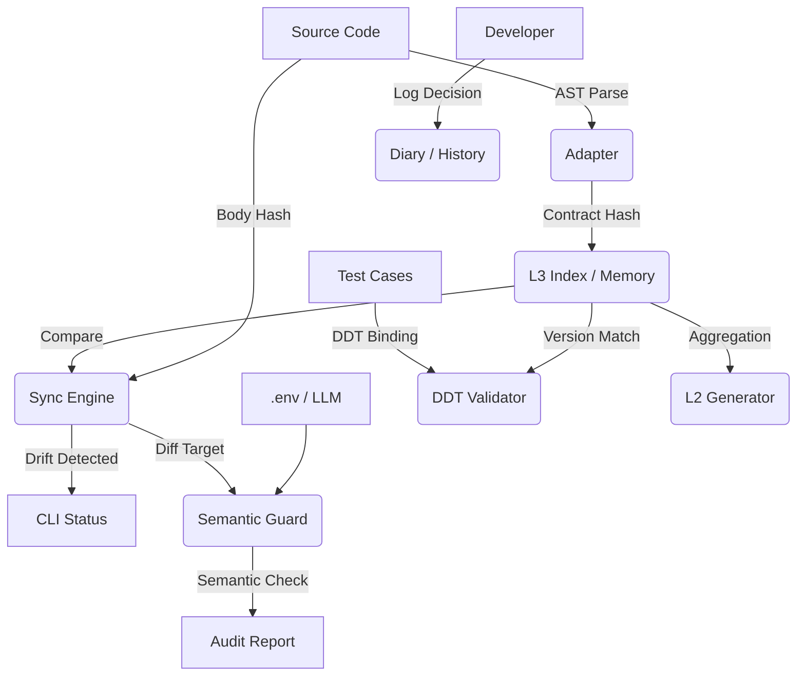

<div align="center">

# ⚓ Harbor
### The Context Governance Engine for Vibe Coding

[](https://github.com/your-org/harbor-spec/actions)
[](https://www.python.org/)
[](LICENSE)
[](https://github.com/your-org/harbor-spec)

**Manage AI like Code. Version Context like Git.**
**It will help you complete the revolutionary transition from “programmer to context engineer.”**

[Philosophy] • [Architecture] • [Quick Start] • [Migration Guide] • [Workflow] • [Cheatsheet]

</div>

Language: [English](README_en.md) | [中文](README.md)

---

## 🌌 The Era of Vibe Coding

Programming is undergoing a paradigm shift. We are moving from **"Writing Code"** (line-by-line) to **"Vibe Coding"** (collaborating with AI via natural language).

In this new era, **the marginal cost of code generation approaches zero, but the cost of context maintenance is skyrocketing.**

- AI modified the logic, but the Docstring is outdated? 👉 **Context Drift**
- Tests are passing, but validating old logic? 👉 **Validation Gap**
- Why did we make this parameter optional last week? 👉 **Memory Loss**

**Harbor** is born for this. It is not another Copilot; it is the **Overseer of Copilot**. It provides the **"Conscience"** and **"Memory"** governance layer for AI-generated code.

## 🛡️ Core Philosophy

Harbor is built upon **L3 Contract Theory**:

1.  **Code is Volatile, Contract is Immutable**: Implementations can be rewritten by AI at will, but the L3 Docstring (Contract) is the anchor and must be audited.
2.  **Noise is Signal**: Unindexed code, unsynced documentation, and unbound tests are "noise". Harbor makes this noise explicit.
3.  **Trust, but Verify**: We trust AI's coding ability, but we verify its output via AST analysis and Semantic Audits.

## 🏗️ Architecture



-----

## ⚡ Quick Start

### 1\. Installation

```bash
pip install harbor-spec
```

### 2\. Initialize

Run `init` in your project root. Harbor detects your project structure and generates the configuration (including Git-aware filtering):

```bash
harbor init
```

### 3\. Setup AI Role Rules (Critical\!)

To ensure Cursor/Windsurf/Copilot generates Harbor-compliant code, you must configure **Role Rules**.

<details>
<summary><strong>👉 Click to expand: Copy to .cursorrules or .windsurfrules</strong></summary>

````markdown
# Harbor-spec L3 Documentation Standards

You are a Senior Engineer working on a Harbor-spec managed project.
You MUST adhere to the **Strict L3 Contract** for all Python Docstrings.

## Scope of Application
Apply these rules to ALL **Public APIs** (Functions, Methods, and Classes that do not start with `_`).

## Format Specifications
1.  **Style**: Google Style Docstring (Extended).
2.  **Language**: English.
3.  **Indentation**: Use standard 4-space indentation.

## Required Structure
1.  **Summary**: One-line description.
2.  **Harbor Tags** (REQUIRED):
    * `@harbor.scope: public`
    * `@harbor.l3_strictness: strict`
    * `@harbor.idempotency: once` (or idempotent/side-effect)
3.  **Standard Sections**: Args / Returns / Raises.

## Reference Example
```python
def build_index(self, incremental: bool = True) -> IndexReport:
    """Build or incrementally update the L3 index cache.

    Features:
      - Scan configured code roots and parse L3 contract metadata.
      - Compute signature hash and body hash for index entries.

    @harbor.scope: public
    @harbor.l3_strictness: strict
    @harbor.idempotency: once

    Args:
        incremental (bool): Whether to enable incremental build.

    Returns:
        IndexReport: Build statistics.
    """
    ...
```
````

</details>

### 4\. Configure LLM

Create a `.env` file to enable Semantic Audit and Smart Diary features:

```ini
HARBOR_LLM_PROVIDER=openai  # or deepseek, azure
HARBOR_LLM_API_KEY=sk-xxxxxx
HARBOR_LLM_BASE_URL=https://api.openai.com/v1
HARBOR_LANGUAGE=en  # Output reports in English
```

### 5\. Build Baseline

Build the initial index to take control of your current codebase:

```bash
harbor build-index
```

-----

## 🛠️ Migration Guide (Legacy Code)

Have a large existing codebase without Docstrings? Use the **Interactive Decorator** to migrate quickly.

### 1\. Scan and Decorate

```bash
harbor decorate backend/ --strategy safe
```

  * **Safe Mode (Default)**: Identifies functions that *have* docstrings but lack the `@harbor.scope` tag.
  * **Aggressive Mode**: `--strategy aggressive` identifies ALL public functions. It inserts a placeholder docstring (with `TODO`) for functions without documentation.
  * **Dry Run**: Use `--dry-run` to preview changes without writing files.

### 2\. Update Index

After decorating, update Harbor's memory:

```bash
harbor build-index
```

-----

## 🔄 The Vibe Coding Workflow

### Step 1: Check Status

Before working, ensure the codebase is clean.

```bash
harbor status
# Output: No changes detected.
```

### Step 2: Vibe Coding

Use your AI assistant to modify code.
*Scenario: You changed the logic in `utils.py` but forgot to update the Docstring.*

### Step 3: Detect Drift

Harbor detects that the code has "drifted" from its contract.

```bash
harbor status
# Output: M harbor.utils.func (Body changed, Contract static)
```

### Step 4: AI Audit

Invoke the LLM to check for semantic consistency.

```bash
harbor audit --semantic
# Output: [MISMATCH] Code raises 'ValueError' but Docstring does not declare it.
```

### Step 5: Smart Diary (AI-Assisted Logging) ✨

Finished the change? Let AI draft your decision log.

```bash
harbor diary draft
```

  * Harbor analyzes unindexed changes (Drift) and generates a structured diary draft.
  * **Interactive**: You can confirm `[Y]` directly or edit the summary `[e]`.

### Step 6: Lock & Record

Commit the changes to the index.

```bash
harbor build-index
```

-----

## 🧩 Features Deep Dive

<details>
<summary><strong>📐 DDT (Decorator-Driven Testing)</strong></summary>

Prevent "Hollow Green Lights". Bind test cases strictly to code versions.

```python
from harbor.core.ddt import harbor_ddt_target

@harbor_ddt_target("backend.core.calculate_tax", l3_version=1)
def test_calculate_tax():
    ...
```

Run `harbor ddt validate`. If the contract version upgrades to v2, Harbor forces the test to fail, reminding you to update validation logic.

</details>

<details>
<summary><strong>📚 L2 Documentation Generator</strong></summary>

Automatically generate module-level READMEs as a quality dashboard.

```bash
harbor gen l2 --module harbor/core --write
```

Generates a Markdown file listing Public APIs, strictness status, and test coverage.

</details>

<details>
<summary><strong>⚙️ Configuration Management</strong></summary>

Use CLI to manage configuration safely.

```bash
harbor config list                   # View config (Rich Table)
harbor config add "scripts/**"       # Add scan path
harbor config remove "legacy/**"     # Remove scan path
```

</details>

<details>
<summary><strong>🚀 Performance Tuning (Monorepo)</strong></summary>

For large projects, **excluding irrelevant directories** is vital. While `.harbor/config.yaml` supports Git-aware filtering, explicit exclusion is recommended:

```yaml
exclude_paths:
  - ".venv/**"
  - "node_modules/**"  # Critical for frontend projects
  - "**/tests/**"      # Exclude test files from indexing
  - "dist/**"
```

</details>

-----

## 📝 Commands Cheatsheet

| Command | Description |
| :--- | :--- |
| `harbor init` | Auto-detect structure and initialize config. |
| `harbor status` | Check for Code Drift (Body vs Contract). |
| `harbor build-index` | Update the L3 Index (Memory). |
| `harbor decorate` | Interactively migrate legacy code. |
| `harbor audit --semantic` | Run AI-powered semantic consistency checks. |
| `harbor diary draft` | AI-assisted decision log drafting. |
| `harbor diary log` | Manually write a decision log. |
| `harbor gen l2` | Generate module-level documentation. |
| `harbor config` | Manage code roots and paths. |

-----

## 📄 License

MIT © 2025 Harbor-spec Authors.
